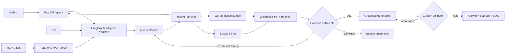

# Adaptive RAG Agent

一个面向招聘展示、同时保留真实工程边界的现代化 RAG 项目：使用
LangGraph 编排**有界、状态持久化的 Agentic Workflow**，组合多查询改写、
Dense + Sparse 混合检索、加权 RRF、CrossEncoder 重排、证据门控和服务端引用校验。

项目不是“让模型无限思考”的黑盒 Agent。确定性的安全、检索和校验步骤由代码控制，
模型主要在查询规划与基于证据生成两个位置做受约束决策，并在引用格式失败时最多执行
一次受限修复。

## 这次升级解决了什么

原项目已经具备 Hybrid RAG 的教学骨架，但 Agent 图仍是线性的，引用只依赖 Prompt，
SQLite 与 Qdrant 缺少文档版本管理，上传和本地路径接口也没有完整边界。
当前版本把它升级为可演示、可测试、可解释的工程项目：

- 自适应 LangGraph：弱证据时最多重试一次检索，引用失败时最多修复一次，杜绝无限循环。
- 持久化会话：SQLite checkpointer + `thread_id`，支持多轮问题中的上下文继承。
- 现代模型接口：默认使用 OpenAI Responses API；兼容只支持 Chat Completions 的第三方服务。
- 多查询 Hybrid Retrieval：保留原始问题，再加入受控改写；Dense 与 FTS5 结果通过加权 RRF 融合。
- 分数语义分离：RRF 只用于排序；证据门控使用 reranker 固定归一化分数、
  dense cosine 或 sparse token coverage，不把排名第一误当作绝对相关。
- 可验证引用：模型只能引用本轮实际进入上下文的 `[S1]`、`[S2]`；服务端会解析、校验和修复。
- Prompt Injection 防护：检索文本作为转义后的不可信数据传入，并在来源中暴露风险标签。
- 幂等增量入库：文档内容哈希、manifest、按文档原子替换、旧向量清理和逐文件失败隔离。
- 安全 API：聊天可选共享密钥、上传强制显式密钥、限定导入根目录、文件数量/大小限制、
  流式落盘、扩展名与 magic 校验。
- 可观测输出：`trace_id`、节点级耗时、查询策略、分数明细、模型调用与 token 使用量。
- 可运行产品界面：零构建浅色文档工作台，支持原始文件名展示、上传与安全删除、
  SSE 节点进度、引用定位、运行追踪、请求中止和移动端抽屉。
- 可互操作接口：只读 MCP 工具 `search_knowledge_base` 与 `ask_knowledge_base`。
- 工程门禁：Docker、GitHub Actions、Ruff、pytest、coverage、pre-commit 和离线检索评测。

CI 对单元测试设置了 **75% 总覆盖率门槛**。这不是模型效果指标；检索效果必须用
你自己的版本化数据集重新运行评测，不能在简历中编造提升百分比。

## 架构



详细设计见：

- [系统架构](docs/architecture.md)
- [2026 技术雷达与选型依据](docs/technology-radar-2026.md)
- [评测方法](docs/evaluation.md)
- [安全边界](docs/security.md)
- [简历与面试表达](docs/resume-guide.md)
- [代码阅读路线](docs/code_walkthrough.md)

## 快速开始

### Windows 一键启动（推荐）

完成一次 `.env` 配置后，日常启动只需要在项目根目录双击 `start.cmd`，或执行：

```powershell
.\start.cmd
```

脚本会自动完成以下工作：

1. 首次运行时创建 `.venv` 并安装项目依赖。
2. 检查并尝试启动 Docker Desktop。
3. 只启动 Qdrant 容器，保留本机现有的 SQLite、上传文件和索引。
4. 在后台启动 API，先确认进程存活，再检查 SQLite 与 Qdrant。
5. 自动打开 [http://127.0.0.1:8000](http://127.0.0.1:8000)（端口跟随 `.env` 的
   `API_PORT`）。

运行日志位于 `storage/api.stderr.log`。若不希望自动打开浏览器：

```powershell
.\start.cmd -NoBrowser
```

首次启动或首次提问可能需要加载本地 Embedding/Reranker 模型，会比后续运行慢。
全新知识库还没有 Qdrant collection 时，脚本会提示上传或导入首份资料，但仍会正常
打开 Web UI。
若页面提示访问 Key 无效，请在左侧“连接设置”中填写 `.env` 里的 `API_ACCESS_KEY`。
不要执行 `docker compose down -v`，该命令会删除 Qdrant 数据卷。

停止后台 API、但保留 Qdrant 和全部数据：

```powershell
.\stop.cmd
```

如需连 Qdrant 容器也一起停止，可运行 `.\stop.cmd -StopQdrant`；该操作仍会保留数据卷。

### 在 PyCharm 中启动或断点调试

1. 打开项目根目录，进入 `File → Settings → Project → Python Interpreter`。
2. 选择现有解释器：`<项目目录>\.venv\Scripts\python.exe`。
3. 如果之前通过 `start.cmd` 启动过后台 API，先在 PyCharm Terminal 执行 `.\stop.cmd`，
   避免端口 `8000` 冲突。Qdrant 会继续运行。
4. 若 Qdrant 尚未运行，执行 `docker compose up -d qdrant`。
5. 在项目树中找到 `scripts/run_api.py`，右键选择 **Run 'run_api'**；需要断点时选择
   **Debug 'run_api'**。
6. 控制台出现 Uvicorn 启动信息后，打开
   [http://127.0.0.1:8000](http://127.0.0.1:8000)。

`run_api.py` 会自动切换到项目根目录、加载 `.env`，并为本地 Qdrant 设置代理绕过，
因此不需要把 Key 复制到 PyCharm Run Configuration。停止调试时点击 PyCharm 的红色
Stop 按钮即可；之后想恢复后台运行，再执行 `.\start.cmd`。

下面是脚本内部对应的手动安装与启动步骤，适合排错或 Linux/macOS 环境。

### 1. 安装

Python 3.10–3.14 均在项目约束内，建议使用 3.12。

```powershell
python -m venv .venv
.\.venv\Scripts\python -m pip install --upgrade pip
.\.venv\Scripts\python -m pip install -e ".[dev,mcp]"
Copy-Item .env.example .env
```

Linux/macOS 可先运行 `source .venv/bin/activate`，再把后续
`.\.venv\Scripts\python`、`*.exe` 命令分别替换成 `python` 和对应的无后缀命令；
复制配置使用 `cp .env.example .env`。

编辑 `.env`，至少填写：

```dotenv
OPENAI_API_KEY=your-key
LLM_API_MODE=responses
CHAT_MODEL=gpt-5.6-luna
# 上传接口必须显式配置该 Key；聊天在本机演示时可以留空。
API_ACCESS_KEY=choose-a-local-secret
```

若第三方 OpenAI-compatible 服务不支持 Responses API，可设置：

```dotenv
LLM_API_MODE=chat_completions
OPENAI_BASE_URL=https://your-provider.example/v1
CHAT_MODEL=your-model
```

### 2. 启动 Qdrant

```powershell
docker compose up -d qdrant
```

Qdrant 只绑定 `127.0.0.1`，不会默认暴露到局域网或公网。

### 3. 导入资料

把 PDF、DOCX、Markdown、TXT 或 HTML 文件放入 `data/raw/`：

```powershell
.\.venv\Scripts\python scripts/ingest.py --path data/raw --json
```

重复执行时，只有内容哈希、索引指纹和 Qdrant 向量数量都一致才会跳过。索引指纹包含
切片参数、embedding、collection 和 schema 版本。只有明确需要全量重建时才使用
`--reset`；强制重建单个未变化文档可使用 `--force`。

> 从旧版项目升级：旧 SQLite chunk 无法可靠回填文档身份，首次启动会清理这些派生行并记录
> warning。请保留 `data/raw/` 原始资料，并执行一次带 `--reset` 的完整导入。

### 4. 启动应用

```powershell
.\.venv\Scripts\rag-agent-api.exe
```

打开 [http://127.0.0.1:8000](http://127.0.0.1:8000) 使用 Web UI，
或打开 [http://127.0.0.1:8000/docs](http://127.0.0.1:8000/docs) 查看 OpenAPI。

交互入口不只 Web：

| 入口 | 适合场景 | 使用方式 |
|---|---|---|
| Knowledge Workspace | 招聘演示、上传/删除资料、查看引用与运行追踪 | 浏览器打开 `/` |
| CLI | 脚本调用、快速验证、持续集成 | `scripts/query.py` |
| REST / SSE | 前端或其他服务集成 | `/api/v1/chat`、`/api/v1/chat/stream` |
| Swagger | 手动调试 HTTP 契约 | 浏览器打开 `/docs` |
| MCP | 让支持 MCP 的 Agent/IDE 只读调用知识库 | `rag-agent-mcp` |

也可以直接使用 CLI：

```powershell
.\.venv\Scripts\python scripts/query.py "这个系统怎样保证引用有效？" --json
```

使用同一个会话 ID 可演示持久化多轮状态：

```powershell
.\.venv\Scripts\python scripts/query.py "引用校验是什么？" --thread-id interview-demo
.\.venv\Scripts\python scripts/query.py "它失败后会怎样？" --thread-id interview-demo
```

当前 CLI 是一次命令完成一次问答，不是全屏交互式 TUI；通过复用 `--thread-id`
可以连续演示多轮状态。

没有配置 LLM Key 时，系统仍能测试入库与检索，但会明确拒绝生成最终答案。

## Docker 一键启动

```powershell
$env:OPENAI_API_KEY="your-key"
$env:API_ACCESS_KEY="choose-a-local-secret"
$env:ADMIN_API_KEY="choose-a-different-admin-secret"
docker compose up --build
```

应用和 Qdrant 都只映射到本机回环地址。若准备公开部署，必须额外配置 TLS、
强认证、持久化任务队列、速率限制和租户/文档 ACL；当前 Compose 定位是本地演示。

Compose 使用 named volume，宿主机的 `./data/raw` 不会自动映射进容器。Docker 模式请
通过 Web UI 或 `/api/v1/documents` 上传；`/api/v1/ingest` 看到的是容器 volume 内路径。

## HTTP API

| 方法 | 路径 | 说明 |
|---|---|---|
| `GET` | `/health/live` | 进程存活检查 |
| `GET` | `/health/ready` | SQLite 与 Qdrant 依赖就绪检查 |
| `POST` | `/api/v1/chat` | 同步问答，返回答案、引用、证据判断与 trace |
| `POST` | `/api/v1/chat/stream` | SSE 输出节点完成事件与最终答案 |
| `POST` | `/api/v1/documents` | 安全上传文件并返回后台 `job_id` |
| `POST` | `/api/v1/ingest` | 管理员导入允许根目录内的服务器文件，可显式 reset |
| `GET` | `/api/v1/jobs/{job_id}` | 查询入库任务状态 |
| `GET` | `/api/v1/sources` | 查看脱敏后的资料清单与删除资格 |
| `DELETE` | `/api/v1/sources/{document_id}` | 删除浏览器上传的受管资料及其索引/向量 |

设置 `API_ACCESS_KEY` 后，业务接口必须携带；上传接口在该 Key 为空时会直接关闭：

```http
X-API-Key: your-secret
```

Web UI 的“连接设置”中也需要填写同一个 Key。服务器路径导入使用独立
`ADMIN_API_KEY` / `X-Admin-Key`；未配置管理员 Key 时该接口关闭。

来源删除与上传使用同一个本地 `API_ACCESS_KEY`，但只允许操作
`ALLOWED_INGEST_ROOT/uploads` 下的受管副本。管理员通过服务器路径导入的文件会在
Web UI 中标记为不可删除，接口也会再次校验边界；网页不会 unlink 任意本地文件。

问答示例：

```powershell
$body = @{
  question = "系统如何减少幻觉？"
  thread_id = "demo-thread"
  include_trace = $true
} | ConvertTo-Json

Invoke-RestMethod `
  -Method Post `
  -Uri http://127.0.0.1:8000/api/v1/chat `
  -ContentType "application/json" `
  -Headers @{"X-API-Key" = "your-secret"} `
  -Body $body
```

## MCP

MCP 是这个知识库的互操作接口，不替代 LangGraph 工作流。服务只暴露读取能力，
不会通过 MCP 上传文件或清空索引：

```powershell
.\.venv\Scripts\rag-agent-mcp.exe
```

默认使用 `stdio`；设置 `MCP_TRANSPORT=streamable-http` 可切换传输方式。
可用能力：

- `search_knowledge_base`：返回排序后的证据片段，供宿主 Agent 自己组织答案。
- `ask_knowledge_base`：执行完整的有界问答图并返回已校验来源。
- `rag://sources`：读取当前文档 manifest。

## 测试与评测

```powershell
.\.venv\Scripts\ruff check .
.\.venv\Scripts\ruff format --check .
.\.venv\Scripts\pytest --cov=rag_agent --cov-report=term-missing
```

离线检索评测使用仓库内 JSONL 数据集，输出 Recall@K、MRR、nDCG 与延迟报告：

```powershell
.\.venv\Scripts\python scripts/eval_retrieval.py `
  --file data/eval/sample_retrieval.jsonl `
  --output-dir reports
```

`data/eval/sample_retrieval.jsonl` 只是格式示例。用于简历前，应替换或扩充为
版本化、可公开的测试资料和 50–80 道题，并保留真实的 baseline/ablation 报告。

## 项目结构

```text
src/rag_agent/
├── agent/          # LangGraph 状态图、提示词、引用与注入防护
├── api/            # FastAPI、请求模型、后台任务状态
├── evaluation/     # Recall/MRR/nDCG 指标
├── ingest/         # 文件解析、结构化切片、幂等索引
├── llm/            # Responses / Chat Completions 适配层
├── mcp/            # 只读 MCP server
├── retrieval/      # Qdrant、FTS5、加权 RRF、reranker
└── web/            # 零构建演示界面
```

## 关键设计取舍

- **Workflow 没有过时**：生产系统需要可重放、可测试的固定控制点；Agent 自主性只放在
  能通过评测证明价值的节点。
- **只保留一个编排层**：LangGraph 管理状态和循环，LLM client 只是模型传输层，
  不再嵌套另一个 Agents SDK 循环。
- **暂不堆多 Agent、A2A、GraphRAG**：当前问题没有独立部署的多个 Agent，也没有证据
  表明图检索优于 Hybrid + Rerank；增加名词不等于增加项目质量。
- **SQLite 是文本真源**：新向量先写 Qdrant，再原子替换 SQLite 文档版本，最后清理旧向量。
  即使清理失败，无法在 SQLite 解析的孤儿向量也不会进入答案上下文。
- **拒答是产品能力**：证据不足、引用无效或模型不可用时返回结构化拒答，而不是编造答案。
- **有界包括四类预算**：问题/查询长度、查询变体和图重试次数、模型输出 token、
  上传大小与数量都有显式上限。

用户问题、有限历史和检索片段会发送到 `OPENAI_BASE_URL`。`LLM_STORE_RESPONSES=false`
只表示请求不主动使用 Responses 存储，不代表本地推理或提供商零留存；敏感资料上线前必须
核对所用提供商的数据政策。

完整的 2026 技术更新依据和重新评估条件见
[技术雷达](docs/technology-radar-2026.md)。

## 简历描述

可以在完成你自己的真实评测后写成：

> 独立设计并实现基于 LangGraph 的有界、状态持久化 Agentic RAG 系统，完成多查询规划、
> Dense/FTS5 混合检索、加权 RRF、CrossEncoder 重排、证据门控与服务端引用校验；
> 通过文档哈希与原子版本替换实现幂等增量索引，并建设 FastAPI/SSE、MCP、Docker、
> CI 和离线 Recall/MRR/nDCG 评测链路。

不要写“准确率提升 30%”之类未经报告证明的数字。可核验的面试表达和 STAR 模板见
[简历指南](docs/resume-guide.md)。

## License

[MIT](LICENSE)
