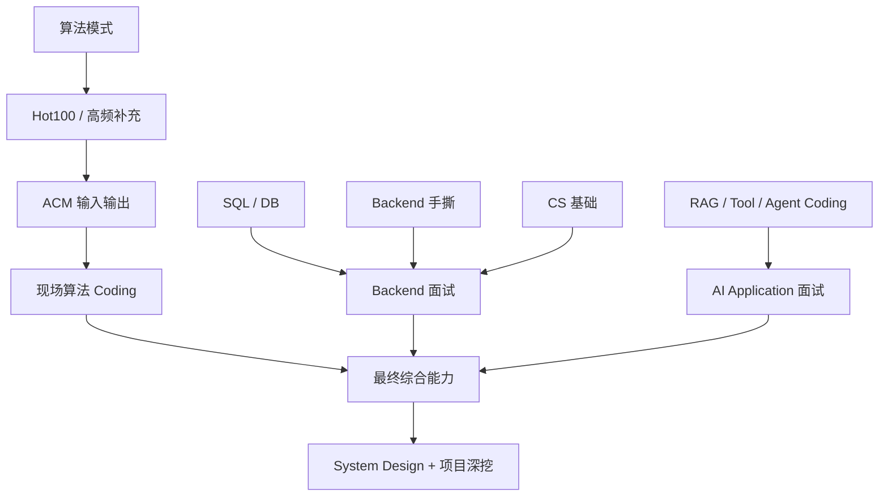
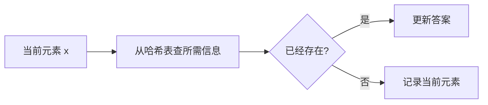
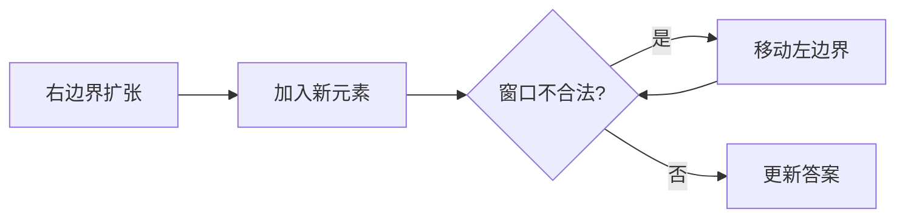
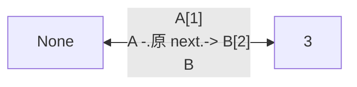
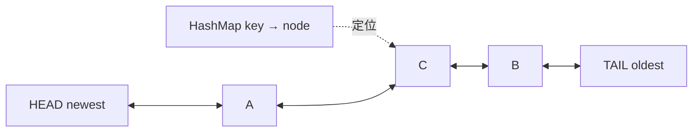
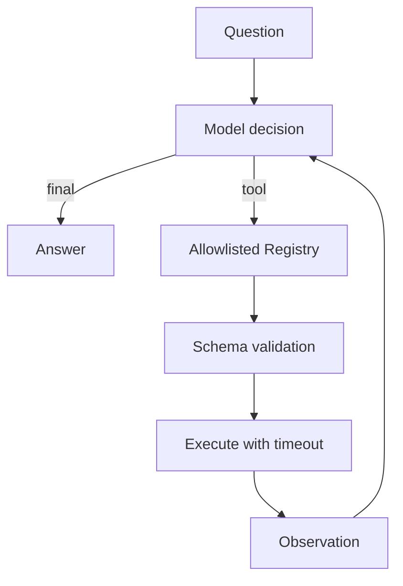

# Agent Backend / AI Application 面试算法与 Coding 教材

> **版本**：2026-09-07 · 第四版（自包含题库版）  
> **目标岗位**：Agent Backend、AI Application Engineer、大模型应用研发、LLM Application Engineer、AI 全栈偏后端、Data/Search/Knowledge Agent、Agent Runtime 初级岗位。

这不是“题号清单”。目标是让你**只打开这一份文档，也能完成主要算法、SQL、Backend Coding 和 AI Coding 学习**。

---

## 快速导航

| 区域 | 你要学什么 | 建议顺序 |
|---|---|---:|
| Part A–J | Hash、双指针、滑窗、链表、树、堆、二分、图、回溯、贪心、DP、Trie、LRU | 1 |
| Part K | Quick Sort、Merge Sort、Dijkstra、Difference Array | 2 |
| Part L | ACM 输入输出 | 3 |
| Part M | SQL 与数据库面试 | 4 |
| Part N | 限流、Token Bucket、Retry、TTL Cache、Queue、并发控制 | 5 |
| Part O | FastAPI、SSE、Tool Calling | 6 |
| Part P | 12 周训练计划 | 按周执行 |
| Part Q | 复习与最终验收 | 全程使用 |
| Appendix | GitHub 参考项目与维护规则 | 按需看 |

### 优先级图例

| 标记 | 含义 | 目标 |
|---|---|---|
| **P0** | 当前目标岗位的核心高频题 | 一周后仍能从空白写 |
| **P1** | 高频补充 / 重要变化题 | 能识别模式并独立完成大部分 |
| **P2** | 进阶或特定公司/岗位补充 | 有余力再扩展 |

### 掌握度图例

| 状态 | 标准 |
|---|---|
| A | 完全不会 |
| B | 看解析能理解 |
| C | 当天能从空白写 |
| D | 一周后仍能从空白写，并能应对一个变化条件 |

> **P0 最终尽量全部达到 D。** “AC 过一次”不等于掌握。

---

## 这份教材怎么用

每一道纳入路线的题都尽量包含：

```text
题型 / 优先级
→ 自写题意（不复制 LeetCode 原文）
→ 原创小例子
→ 识别信号
→ 核心思路 / 不变量
→ 完整 Python 解法
→ 时间 / 空间复杂度
→ 常见错误
→ 变化题 / 面试追问
→ Backend / Agent 迁移（适用时）
```

题解默认使用 `<details>` 折叠。**先自己想，再展开答案。**

建议每题：

```text
先读题意
→ 不看答案想 10–20 分钟
→ 说出暴力思路
→ 找模式 / 不变量
→ 写最优解
→ 手测边界
→ 解释复杂度
→ 面试官改条件
→ Day 1 / 3 / 7 / 14 复写
```

> 版权边界：题号与标题用于定位；题意、例子、解析和代码均在本项目中重新表述/编写，不复制第三方题解或 LeetCode 原题全文。

---

## 一张图看完整训练体系



结论：**Hot100 是算法主干，但 Agent Backend / AI Application 面试绝不只有 Hot100。**

对于当前目标，优先级：

1. P0 算法题做到一周后仍能独立写；
2. P1 能识别并完成大部分；
3. SQL、LRU、限流、队列、retry、SSE 等能现场写；
4. 能把算法迁移到 Agent Backend 工程。

---

## 数据结构基础约定

以下链表/树题默认使用这些常见结构：

```python
class ListNode:
    def __init__(self, val=0, next=None):
        self.val = val
        self.next = next


class TreeNode:
    def __init__(self, val=0, left=None, right=None):
        self.val = val
        self.left = left
        self.right = right
```

面试平台通常会提供它们；真正训练时，你也应该会自己写。

---

# Part A · Array / Hash / Two Pointers / Window

## 1. Hash · 看到“查过没有、计数、分组、配对”先想到哈希



<details>
<summary><b>LC 1 · Two Sum · Hash · P0</b></summary>

**题意**：给定整数数组和目标值，找两个不同下标，使两数之和等于目标值。

**例子**：`[4, 7, 1, 9]`，目标 `10`，可返回下标 `[2, 3]`，因为 `1 + 9 = 10`。

**识别信号**：两数配对；需要快速回答“我之前见过 target-x 吗？”

**思路**：从左到右扫描。处理 `x` 时，若 `target-x` 已在哈希表，就找到答案；否则记录 `x -> index`。

```python
def two_sum(nums, target):
    seen = {}
    for i, x in enumerate(nums):
        need = target - x
        if need in seen:
            return [seen[need], i]
        seen[x] = i
    return []
```

**复杂度**：时间 O(n)，空间 O(n)。

**易错**：先写入再查询会在 `target=2*x` 时错误地使用同一个元素两次。

**追问**：若数组已排序，可用双指针 O(1) 额外空间。

**工程迁移**：哈希索引是 cache、session lookup、tool registry 的基本思想。
</details>

<details>
<summary><b>LC 49 · Group Anagrams · Hash + Canonical Key · P0</b></summary>

**题意**：把由相同字符、不同排列组成的字符串放到同一组。

**例子**：`["eat", "tea", "tan", "ate"]` → `eat/tea/ate` 一组，`tan` 一组。

**识别信号**：按“等价特征”分组。

**思路**：把每个字符串排序后的结果作为规范化 key；同 key 的字符串归一组。

```python
from collections import defaultdict


def group_anagrams(words):
    groups = defaultdict(list)
    for word in words:
        key = "".join(sorted(word))
        groups[key].append(word)
    return list(groups.values())
```

**复杂度**：若平均字符串长 k，总体约 O(n * k log k)。

**易错**：不要用 `set(word)`，它会丢失字符次数。

**追问**：若字符集固定为 26 个小写字母，可用 26 维计数 tuple，把单词处理降到 O(k)。

**工程迁移**：canonical key / normalization 常用于去重、cache key、请求归一化。
</details>

<details>
<summary><b>LC 128 · Longest Consecutive Sequence · Hash Set · P0</b></summary>

**题意**：无序整数数组中，找最长连续整数序列长度；要求尽量线性时间。

**例子**：`[8, 1, 3, 2, 10]` → `1,2,3`，答案 3。

**识别信号**：无序数组 + 连续整数 + O(n)。

**核心不变量**：只从“序列起点”扩张。若 `x-1` 已存在，x 不是起点，不重复扫描。

```python
def longest_consecutive(nums):
    values = set(nums)
    best = 0
    for x in values:
        if x - 1 in values:
            continue
        y = x
        while y in values:
            y += 1
        best = max(best, y - x)
    return best
```

**复杂度**：平均 O(n) 时间，O(n) 空间。

**易错**：对每个元素都向两边扩张会退化到 O(n²)。

**追问**：为什么 while 总次数仍是 O(n)？因为每条连续链只从起点完整走一次。
</details>

<details>
<summary><b>LC 347 · Top K Frequent Elements · Counter + Heap · P0</b></summary>

**题意**：返回出现频率最高的 k 个不同元素。

**例子**：`[1,1,1,2,2,3]`, k=2 → `[1,2]`。

**识别信号**：TopK、频率排序。

```python
from collections import Counter
import heapq


def top_k_frequent(nums, k):
    freq = Counter(nums)
    return [x for x, _ in heapq.nlargest(k, freq.items(), key=lambda p: p[1])]
```

**复杂度**：计数 O(n)，堆法约 O(m log k)，m 为不同元素数。

**易错**：不要默认“TopK 就排序全部”；当 m 很大时堆更合适。

**工程迁移**：热门 query、TopK 文档、日志高频错误码都可用同一思路。
</details>

### 这一类你应该会什么

- 能解释 HashMap / Set 为什么能把很多 O(n²) 查找降到平均 O(n)；
- 能为“分组/去重/配对”设计稳定 key；
- 知道 TopK 什么时候用堆，什么时候直接排序更简单。

---

## 2. Two Pointers · 移动指针必须有正确性理由

<details>
<summary><b>LC 283 · Move Zeroes · Two Pointers · P0</b></summary>

**题意**：原地把所有 0 移到数组末尾，同时保持非零元素相对顺序。

**例子**：`[0,1,0,3,2]` → `[1,3,2,0,0]`。

**思路**：`slow` 指向下一个非零元素应该放的位置，`fast` 扫描；遇到非零就交换到 slow。

```python
def move_zeroes(nums):
    slow = 0
    for fast in range(len(nums)):
        if nums[fast] != 0:
            nums[slow], nums[fast] = nums[fast], nums[slow]
            slow += 1
```

**复杂度**：O(n) 时间，O(1) 空间。

**易错**：另开数组虽简单，但违背原地要求。

**工程迁移**：稳定压缩 / filter-in-place。
</details>

<details>
<summary><b>LC 11 · Container With Most Water · Two Pointers · P0</b></summary>

**题意**：每个数组值代表竖线高度，选两条线形成容器，使面积最大。

**面积**：`min(height[l], height[r]) * (r-l)`。

**核心推理**：宽度每次都会变小；为了可能增大面积，只能移动较短的一侧，尝试提高“短板”。

```python
def max_area(height):
    l, r = 0, len(height) - 1
    ans = 0
    while l < r:
        ans = max(ans, min(height[l], height[r]) * (r - l))
        if height[l] <= height[r]:
            l += 1
        else:
            r -= 1
    return ans
```

**复杂度**：O(n) / O(1)。

**易错**：移动较高一侧无法改善当前短板，缺乏正确性依据。
</details>

<details>
<summary><b>LC 15 · 3Sum · Sort + Two Pointers · P0</b></summary>

**题意**：找所有不重复的三元组，使三个数之和为 0。

**例子**：`[-1,0,1,2,-1,-4]` → `[-1,-1,2]`、`[-1,0,1]`。

**思路**：排序后固定第一个数 i，剩余区间用双指针找两数和 `-nums[i]`；对 i、l、r 都要去重。

```python
def three_sum(nums):
    nums.sort()
    ans = []
    n = len(nums)
    for i in range(n - 2):
        if i > 0 and nums[i] == nums[i - 1]:
            continue
        if nums[i] > 0:
            break
        l, r = i + 1, n - 1
        while l < r:
            s = nums[i] + nums[l] + nums[r]
            if s < 0:
                l += 1
            elif s > 0:
                r -= 1
            else:
                ans.append([nums[i], nums[l], nums[r]])
                l += 1
                r -= 1
                while l < r and nums[l] == nums[l - 1]:
                    l += 1
                while l < r and nums[r] == nums[r + 1]:
                    r -= 1
    return ans
```

**复杂度**：O(n²) 时间；排序额外空间依实现。

**易错**：最大难点是去重，不是双指针本身。

**追问**：扩展到 4Sum / nSum 时如何递归降维？
</details>

<details>
<summary><b>LC 42 · Trapping Rain Water · Two Pointers · P0</b></summary>

**题意**：柱状高度数组中，计算下雨后能积多少水。

**直觉**：某位置水位由左侧最高和右侧最高的较小值决定。

```python
def trap(height):
    l, r = 0, len(height) - 1
    left_max = right_max = 0
    water = 0
    while l < r:
        if height[l] <= height[r]:
            left_max = max(left_max, height[l])
            water += left_max - height[l]
            l += 1
        else:
            right_max = max(right_max, height[r])
            water += right_max - height[r]
            r -= 1
    return water
```

**复杂度**：O(n) / O(1)。

**易错**：不理解“为什么可以只看当前较短侧”就容易写错。

**变化**：也可用单调栈按横向水层结算。
</details>

### 这一类你应该会什么

- 每次移动 left/right 时能说出“为什么不会漏解”；
- 能区分同向快慢指针与左右夹逼双指针；
- 遇到有序数组先检查是否能用双指针替代 Hash。

---

## 3. Sliding Window · 连续区间 + 动态满足条件



<details>
<summary><b>LC 3 · Longest Substring Without Repeating Characters · Sliding Window · P0</b></summary>

**题意**：求字符串中最长“不含重复字符”的连续子串长度。

**例子**：`"abcaef"` → 最长可为 `"bcaef"`，长度 5。

```python
def length_of_longest_substring(s):
    last = {}
    left = 0
    best = 0
    for right, ch in enumerate(s):
        if ch in last and last[ch] >= left:
            left = last[ch] + 1
        last[ch] = right
        best = max(best, right - left + 1)
    return best
```

**复杂度**：O(n) / O(字符集)。

**易错**：`left = last[ch] + 1` 前必须确认旧位置仍在当前窗口内，否则 left 可能倒退。

**工程迁移**：最近窗口内唯一 session/token 等去重逻辑。
</details>

<details>
<summary><b>LC 438 · Find All Anagrams in a String · Fixed Window · P0</b></summary>

**题意**：在长字符串中找所有长度等于模式串、且字符多重集合相同的子串起点。

**例子**：s=`"cbaebabacd"`, p=`"abc"`，起点 0 和 6。

```python
from collections import Counter


def find_anagrams(s, p):
    need = Counter(p)
    window = Counter()
    ans = []
    k = len(p)
    for i, ch in enumerate(s):
        window[ch] += 1
        if i >= k:
            old = s[i - k]
            window[old] -= 1
            if window[old] == 0:
                del window[old]
        if i >= k - 1 and window == need:
            ans.append(i - k + 1)
    return ans
```

**复杂度**：使用小字符集时近似 O(n)；Counter 相等检查与字符集大小有关。

**追问**：如何用 matched-count 避免每次比较整个 Counter？
</details>

<details>
<summary><b>LC 76 · Minimum Window Substring · Variable Window · P0</b></summary>

**题意**：在 s 中找最短连续子串，使它包含 t 的全部字符及次数。

**核心模式**：右边扩直到“满足”；满足后不断收缩左边，直到刚好不满足。

```python
from collections import Counter


def min_window(s, t):
    if not t:
        return ""
    need = Counter(t)
    missing = len(t)
    left = 0
    best_l, best_r = 0, float("inf")

    for right, ch in enumerate(s):
        if need[ch] > 0:
            missing -= 1
        need[ch] -= 1

        while missing == 0:
            if right - left + 1 < best_r - best_l:
                best_l, best_r = left, right + 1
            old = s[left]
            need[old] += 1
            if need[old] > 0:
                missing += 1
            left += 1

    return "" if best_r == float("inf") else s[best_l:best_r]
```

**复杂度**：O(n + |t|) 平均时间，O(字符集) 空间。

**易错**：`while missing==0` 不能写成 `if`，因为需要尽可能收缩。
</details>

<details>
<summary><b>LC 239 · Sliding Window Maximum · Monotonic Queue · P1</b></summary>

**题意**：固定大小 k 的窗口从左向右滑动，输出每个窗口最大值。

**思路**：deque 存“可能成为最大值”的下标，保证对应值单调递减。新元素进来时，尾部更小元素永久失去竞争资格，弹掉。

```python
from collections import deque


def max_sliding_window(nums, k):
    q = deque()
    ans = []
    for i, x in enumerate(nums):
        while q and q[0] <= i - k:
            q.popleft()
        while q and nums[q[-1]] <= x:
            q.pop()
        q.append(i)
        if i >= k - 1:
            ans.append(nums[q[0]])
    return ans
```

**复杂度**：O(n) 时间，因为每个下标最多进出 deque 各一次；O(k) 空间。

**工程迁移**：窗口指标、限流统计、在线监控。
</details>

### 这一类你应该会什么

- 一眼区分固定窗口与可变窗口；
- 能回答什么时候扩、什么时候缩、什么时候更新答案；
- 理解滑动窗口为什么能迁移到 Rate Limiter。

---

## 4. Prefix Sum / Prefix Product

<details>
<summary><b>LC 560 · Subarray Sum Equals K · Prefix Sum + Hash · P0</b></summary>

**题意**：统计和等于 k 的连续子数组数量。

**关键等式**：若 `prefix[j]-prefix[i]=k`，则 `prefix[i]=prefix[j]-k`。

```python
from collections import defaultdict


def subarray_sum(nums, k):
    count = defaultdict(int)
    count[0] = 1
    prefix = 0
    ans = 0
    for x in nums:
        prefix += x
        ans += count[prefix - k]
        count[prefix] += 1
    return ans
```

**复杂度**：O(n) / O(n)。

**易错**：`count[0]=1` 代表从数组起点开始的子数组。

**为什么不能普通滑窗**：数组可含负数，窗口和不具有单调性。
</details>

<details>
<summary><b>LC 238 · Product of Array Except Self · Prefix/Suffix · P0</b></summary>

**题意**：对每个位置 i，返回除 nums[i] 外所有元素的乘积，不能使用除法。

```python
def product_except_self(nums):
    n = len(nums)
    ans = [1] * n
    prefix = 1
    for i in range(n):
        ans[i] = prefix
        prefix *= nums[i]

    suffix = 1
    for i in range(n - 1, -1, -1):
        ans[i] *= suffix
        suffix *= nums[i]
    return ans
```

**复杂度**：O(n) 时间；不计输出数组，额外 O(1)。

**识别信号**：“当前位置答案依赖左侧整体 + 右侧整体”。

**易错**：有 0 时用“总乘积 / 当前值”会直接失效。
</details>

---

# Part B · Linked List

## 5. 链表核心 · 每次改 next 前先保存后继

<details>
<summary><b>LC 206 · Reverse Linked List · Pointer Reversal · P0</b></summary>

**题意**：把单链表方向全部反转。



```python
def reverse_list(head):
    prev, cur = None, head
    while cur:
        nxt = cur.next
        cur.next = prev
        prev = cur
        cur = nxt
    return prev
```

**复杂度**：O(n) / O(1)。

**易错**：没先保存 `cur.next` 就改指针，会丢掉剩余链表。
</details>

<details>
<summary><b>LC 21 · Merge Two Sorted Lists · Linked List Merge · P0</b></summary>

**题意**：合并两个升序链表为一个升序链表。

```python
def merge_two_lists(a, b):
    dummy = tail = ListNode()
    while a and b:
        if a.val <= b.val:
            tail.next, a = a, a.next
        else:
            tail.next, b = b, b.next
        tail = tail.next
    tail.next = a or b
    return dummy.next
```

**复杂度**：O(m+n) / O(1)。

**技巧**：dummy node 消除头节点特殊分支。
</details>

<details>
<summary><b>LC 141 · Linked List Cycle · Fast/Slow Pointers · P0</b></summary>

**题意**：判断单链表是否存在环。

```python
def has_cycle(head):
    slow = fast = head
    while fast and fast.next:
        slow = slow.next
        fast = fast.next.next
        if slow is fast:
            return True
    return False
```

**复杂度**：O(n) / O(1)。

**追问**：如何找到入环节点？相遇后让一个指针回到 head，两者每次走一步，再次相遇处即入口。
</details>

<details>
<summary><b>LC 160 · Intersection of Two Linked Lists · Pointer Switching · P0</b></summary>

**题意**：两个单链表若共享后半段节点，返回第一个共享节点。

**思路**：a 走完 A 后转 B；b 走完 B 后转 A。两者都走 m+n 距离，因此若有交点会同步到达。

```python
def get_intersection_node(head_a, head_b):
    a, b = head_a, head_b
    while a is not b:
        a = a.next if a else head_b
        b = b.next if b else head_a
    return a
```

**复杂度**：O(m+n) / O(1)。

**易错**：比较节点身份，不是节点值。
</details>

<details>
<summary><b>LC 19 · Remove Nth Node From End · Two Pointers + Dummy · P0</b></summary>

**题意**：删除倒数第 n 个节点。

```python
def remove_nth_from_end(head, n):
    dummy = ListNode(0, head)
    fast = slow = dummy
    for _ in range(n + 1):
        fast = fast.next
    while fast:
        fast = fast.next
        slow = slow.next
    slow.next = slow.next.next
    return dummy.next
```

**复杂度**：O(n) / O(1)。

**易错**：为什么 fast 先走 `n+1` 步？因为 slow 最终要停在待删除节点的前驱。
</details>

<details>
<summary><b>LC 2 · Add Two Numbers · Linked List Simulation · P0</b></summary>

**题意**：两个链表按低位到高位存数字，逐位相加并处理进位。

```python
def add_two_numbers(a, b):
    dummy = tail = ListNode()
    carry = 0
    while a or b or carry:
        total = carry
        if a:
            total += a.val
            a = a.next
        if b:
            total += b.val
            b = b.next
        carry, digit = divmod(total, 10)
        tail.next = ListNode(digit)
        tail = tail.next
    return dummy.next
```

**复杂度**：O(max(m,n)) 时间。

**易错**：最后一个 carry 不能漏。
</details>

<details>
<summary><b>LC 25 · Reverse Nodes in k-Group · Segment Reversal · P1</b></summary>

**题意**：链表每 k 个节点为一组反转；不足 k 个的尾部保持原顺序。

```python
def reverse_k_group(head, k):
    dummy = ListNode(0, head)
    group_prev = dummy

    while True:
        kth = group_prev
        for _ in range(k):
            kth = kth.next
            if not kth:
                return dummy.next
        group_next = kth.next

        prev, cur = group_next, group_prev.next
        while cur is not group_next:
            nxt = cur.next
            cur.next = prev
            prev = cur
            cur = nxt

        old_start = group_prev.next
        group_prev.next = kth
        group_prev = old_start
```

**复杂度**：O(n) / O(1)。

**难点**：每组的四个边界：`group_prev`、组首、kth、`group_next`。
</details>

<details>
<summary><b>LC 138 · Copy List with Random Pointer · Hash Mapping · P1</b></summary>

**题意**：链表节点除了 next 还有 random 指针，深拷贝整个结构。

```python
def copy_random_list(head):
    if not head:
        return None
    mp = {}
    cur = head
    while cur:
        mp[cur] = type(cur)(cur.val)
        cur = cur.next
    cur = head
    while cur:
        mp[cur].next = mp.get(cur.next)
        mp[cur].random = mp.get(cur.random)
        cur = cur.next
    return mp[head]
```

**复杂度**：O(n) 时间，O(n) 空间。

**追问**：能否 O(1) 额外空间？可以把复制节点临时穿插到原链表中，再拆分。
</details>

### 这一类你应该会什么

- dummy node、快慢指针、指针换路；
- 改链前先保存后继；
- 能画出 LRU 里的双向链表，而不是只背代码。

---

# Part C · Stack / Monotonic Stack / Queue

<details>
<summary><b>LC 20 · Valid Parentheses · Stack · P0</b></summary>

**题意**：判断括号字符串是否按正确类型和顺序闭合。

```python
def is_valid(s):
    match = {")": "(", "]": "[", "}": "{"}
    stack = []
    for ch in s:
        if ch in match:
            if not stack or stack.pop() != match[ch]:
                return False
        else:
            stack.append(ch)
    return not stack
```

**复杂度**：O(n) / O(n)。

**识别信号**：嵌套结构 + 最近打开的必须最先关闭 → LIFO。
</details>

<details>
<summary><b>LC 155 · Min Stack · Stack + Auxiliary Minimum · P0</b></summary>

**题意**：实现栈，push/pop/top/getMin 都要求 O(1)。

```python
class MinStack:
    def __init__(self):
        self.data = []
        self.mins = []

    def push(self, val):
        self.data.append(val)
        self.mins.append(val if not self.mins else min(val, self.mins[-1]))

    def pop(self):
        self.mins.pop()
        return self.data.pop()

    def top(self):
        return self.data[-1]

    def getMin(self):
        return self.mins[-1]
```

**复杂度**：所有操作 O(1)，空间 O(n)。

**追问**：是否能只在出现新最小值时压入 mins，从而节省空间？可以，但需要处理重复最小值。
</details>

<details>
<summary><b>LC 739 · Daily Temperatures · Monotonic Stack · P0</b></summary>

**题意**：对每一天，求还要等多少天才出现更高温度；若以后没有则 0。

```python
def daily_temperatures(temp):
    ans = [0] * len(temp)
    stack = []
    for i, x in enumerate(temp):
        while stack and temp[stack[-1]] < x:
            j = stack.pop()
            ans[j] = i - j
        stack.append(i)
    return ans
```

**复杂度**：O(n) / O(n)。

**识别信号**：为每个元素找“右侧第一个更大值”。
</details>

<details>
<summary><b>LC 84 · Largest Rectangle in Histogram · Monotonic Stack · P0</b></summary>

**题意**：柱状图中找最大矩形面积。

**核心**：当新柱子更矮时，栈顶高柱子的“右边界”确定；弹栈时左边界由新的栈顶决定。

```python
def largest_rectangle_area(heights):
    arr = [0] + heights + [0]
    stack = [0]
    best = 0
    for i in range(1, len(arr)):
        while arr[stack[-1]] > arr[i]:
            h = arr[stack.pop()]
            width = i - stack[-1] - 1
            best = max(best, h * width)
        stack.append(i)
    return best
```

**复杂度**：O(n) / O(n)。

**易错**：宽度是 `i - stack[-1] - 1`，不是 `i-j`。
</details>

### 这一类你应该会什么

- Stack：嵌套 / 回退 / 最近未匹配；
- Monotonic Stack：找左右第一个更大/更小；
- Monotonic Queue：固定窗口最大/最小。

---

# Part D · Binary Tree / BST

## 6. 树题先定义“递归函数返回什么”

<details>
<summary><b>LC 104 · Maximum Depth of Binary Tree · DFS Recursion · P0</b></summary>

**题意**：求二叉树从根到最深叶子的节点层数。

```python
def max_depth(root):
    if not root:
        return 0
    return 1 + max(max_depth(root.left), max_depth(root.right))
```

**复杂度**：O(n) 时间，递归栈 O(h)。

**核心定义**：`max_depth(node)` 返回“以 node 为根的子树深度”。
</details>

<details>
<summary><b>LC 226 · Invert Binary Tree · Tree Recursion · P0</b></summary>

**题意**：把每个节点的左右子树交换。

```python
def invert_tree(root):
    if not root:
        return None
    root.left, root.right = invert_tree(root.right), invert_tree(root.left)
    return root
```

**复杂度**：O(n) / O(h)。

**易错**：先想清楚当前函数的职责：“返回已经翻转好的子树”。
</details>

<details>
<summary><b>LC 102 · Binary Tree Level Order Traversal · BFS Queue · P0</b></summary>

**题意**：按层输出二叉树节点值。

```python
from collections import deque


def level_order(root):
    if not root:
        return []
    q = deque([root])
    ans = []
    while q:
        level = []
        for _ in range(len(q)):
            node = q.popleft()
            level.append(node.val)
            if node.left:
                q.append(node.left)
            if node.right:
                q.append(node.right)
        ans.append(level)
    return ans
```

**复杂度**：O(n) 时间，O(w) 队列空间。

**工程迁移**：BFS、worker queue、层级依赖遍历。
</details>

<details>
<summary><b>LC 543 · Diameter of Binary Tree · Postorder DFS · P0</b></summary>

**题意**：求树中任意两节点间最长路径的边数。

**核心**：经过某节点的最长路径 = 左子树高度 + 右子树高度；函数自身返回高度给父节点。

```python
def diameter_of_binary_tree(root):
    best = 0

    def depth(node):
        nonlocal best
        if not node:
            return 0
        left = depth(node.left)
        right = depth(node.right)
        best = max(best, left + right)
        return 1 + max(left, right)

    depth(root)
    return best
```

**复杂度**：O(n) / O(h)。

**模式**：“子问题返回一种值，同时全局更新另一种答案”。
</details>

<details>
<summary><b>LC 98 · Validate Binary Search Tree · Bounds / Inorder · P0</b></summary>

**题意**：判断树是否满足 BST：左子树所有值小于当前，右子树所有值大于当前。

```python
def is_valid_bst(root):
    def dfs(node, low, high):
        if not node:
            return True
        if not (low < node.val < high):
            return False
        return dfs(node.left, low, node.val) and dfs(node.right, node.val, high)

    return dfs(root, float("-inf"), float("inf"))
```

**复杂度**：O(n) / O(h)。

**易错**：只比较“节点与直接孩子”不够，因为约束来自所有祖先。
</details>

<details>
<summary><b>LC 230 · Kth Smallest Element in a BST · Inorder · P0</b></summary>

**题意**：BST 中找第 k 小元素。

**核心**：BST 中序遍历天然升序。

```python
def kth_smallest(root, k):
    stack = []
    cur = root
    while True:
        while cur:
            stack.append(cur)
            cur = cur.left
        cur = stack.pop()
        k -= 1
        if k == 0:
            return cur.val
        cur = cur.right
```

**复杂度**：最坏 O(n) 时间，O(h) 空间。

**追问**：若频繁查询 kth，可在节点维护 subtree_size。
</details>

<details>
<summary><b>LC 236 · Lowest Common Ancestor of a Binary Tree · Postorder · P0</b></summary>

**题意**：普通二叉树中找两个节点的最低公共祖先。

```python
def lowest_common_ancestor(root, p, q):
    if not root or root is p or root is q:
        return root
    left = lowest_common_ancestor(root.left, p, q)
    right = lowest_common_ancestor(root.right, p, q)
    if left and right:
        return root
    return left or right
```

**复杂度**：O(n) / O(h)。

**理解**：若 p/q 分别出现在左右子树，当前节点就是汇合点。
</details>

<details>
<summary><b>LC 105 · Construct Binary Tree from Preorder and Inorder · Recursion + Hash · P0</b></summary>

**题意**：已知前序与中序遍历且节点值唯一，重建二叉树。

**核心**：前序第一个是根；根在中序中的位置把左右子树范围切开。

```python
def build_tree(preorder, inorder):
    pos = {v: i for i, v in enumerate(inorder)}
    pre_i = 0

    def dfs(l, r):
        nonlocal pre_i
        if l > r:
            return None
        root_val = preorder[pre_i]
        pre_i += 1
        root = TreeNode(root_val)
        mid = pos[root_val]
        root.left = dfs(l, mid - 1)
        root.right = dfs(mid + 1, r)
        return root

    return dfs(0, len(inorder) - 1)
```

**复杂度**：O(n) 时间，O(n) 哈希 + 递归栈。

**易错**：如果每次用 `inorder.index`，会退化到 O(n²)。
</details>

### 这一类你应该会什么

- 递归函数定义、前/中/后序；
- BFS 分层；
- BST 的全局上下界，不只看父子关系。

---

# Part E · Heap / Binary Search

<details>
<summary><b>LC 215 · Kth Largest Element in an Array · Heap · P0</b></summary>

**题意**：找数组第 k 大，不要求去重。

```python
import heapq


def find_kth_largest(nums, k):
    heap = []
    for x in nums:
        heapq.heappush(heap, x)
        if len(heap) > k:
            heapq.heappop(heap)
    return heap[0]
```

**复杂度**：O(n log k) 时间，O(k) 空间。

**为什么小顶堆**：堆顶是当前 TopK 中最小者，最容易被新大值淘汰。

**工程迁移**：TopK 检索候选、priority task。
</details>

<details>
<summary><b>LC 23 · Merge k Sorted Lists · Heap + Linked List · P0</b></summary>

**题意**：合并 k 条升序链表。

```python
import heapq
import itertools


def merge_k_lists(lists):
    heap = []
    counter = itertools.count()
    for node in lists:
        if node:
            heapq.heappush(heap, (node.val, next(counter), node))

    dummy = tail = ListNode()
    while heap:
        _, _, node = heapq.heappop(heap)
        tail.next = node
        tail = node
        if node.next:
            heapq.heappush(heap, (node.next.val, next(counter), node.next))
    return dummy.next
```

**复杂度**：总 N 个节点，O(N log k)；堆 O(k)。

**易错**：Python 元组前两项相等时会比较 node，需要 tie-break counter。
</details>

<details>
<summary><b>LC 295 · Find Median from Data Stream · Two Heaps · P1</b></summary>

**题意**：不断加入数字，并随时返回当前中位数。

```python
import heapq


class MedianFinder:
    def __init__(self):
        self.low = []   # max heap via negatives
        self.high = []  # min heap

    def addNum(self, num):
        heapq.heappush(self.low, -num)
        heapq.heappush(self.high, -heapq.heappop(self.low))
        if len(self.high) > len(self.low):
            heapq.heappush(self.low, -heapq.heappop(self.high))

    def findMedian(self):
        if len(self.low) > len(self.high):
            return float(-self.low[0])
        return (-self.low[0] + self.high[0]) / 2
```

**不变量**：`len(low) == len(high)` 或 low 多一个；low 全部 ≤ high。

**复杂度**：add O(log n)，median O(1)。
</details>

<details>
<summary><b>LC 704 · Binary Search · Binary Search · P0</b></summary>

**题意**：升序数组中查找目标值下标，不存在返回 -1。

```python
def binary_search(nums, target):
    l, r = 0, len(nums) - 1
    while l <= r:
        m = l + (r - l) // 2
        if nums[m] == target:
            return m
        if nums[m] < target:
            l = m + 1
        else:
            r = m - 1
    return -1
```

**复杂度**：O(log n) / O(1)。

**规则**：固定一种区间定义，这里是闭区间 `[l,r]`。
</details>

<details>
<summary><b>LC 33 · Search in Rotated Sorted Array · Binary Search · P0</b></summary>

**题意**：原本升序数组在某处旋转，元素不重复；查目标值。

**核心**：任意时刻 `[l,m]` 或 `[m,r]` 至少一边有序，先判断有序边，再判断 target 是否落在其中。

```python
def search_rotated(nums, target):
    l, r = 0, len(nums) - 1
    while l <= r:
        m = (l + r) // 2
        if nums[m] == target:
            return m
        if nums[l] <= nums[m]:
            if nums[l] <= target < nums[m]:
                r = m - 1
            else:
                l = m + 1
        else:
            if nums[m] < target <= nums[r]:
                l = m + 1
            else:
                r = m - 1
    return -1
```

**复杂度**：O(log n)。
</details>

<details>
<summary><b>LC 34 · Find First and Last Position · Lower Bound · P0</b></summary>

**题意**：升序数组中返回 target 的起止下标，不存在则 `[-1,-1]`。

```python
def search_range(nums, target):
    def lower_bound(x):
        l, r = 0, len(nums)
        while l < r:
            m = (l + r) // 2
            if nums[m] < x:
                l = m + 1
            else:
                r = m
        return l

    left = lower_bound(target)
    if left == len(nums) or nums[left] != target:
        return [-1, -1]
    right = lower_bound(target + 1) - 1
    return [left, right]
```

**复杂度**：O(log n)。

**必须掌握**：lower_bound = 第一个 `>= x` 的位置。
</details>

<details>
<summary><b>LC 153 · Find Minimum in Rotated Sorted Array · Binary Search · P0</b></summary>

**题意**：无重复升序数组旋转后，找最小值。

```python
def find_min(nums):
    l, r = 0, len(nums) - 1
    while l < r:
        m = (l + r) // 2
        if nums[m] > nums[r]:
            l = m + 1
        else:
            r = m
    return nums[l]
```

**核心**：与最右值比较可判断最小值在 m 右侧还是包含 m 的左侧。

**复杂度**：O(log n)。
</details>

<details>
<summary><b>LC 875 · Koko Eating Bananas · Binary Search on Answer · P1</b></summary>

**题意**：给若干堆香蕉与总小时数 h，找最小整数速度 k，使按该速度逐堆吃完不超时。

**识别信号**：答案是一个数；给定候选 k 可以 O(n) 判断可不可行；可行性对 k 单调。

```python
def min_eating_speed(piles, h):
    def feasible(k):
        return sum((p + k - 1) // k for p in piles) <= h

    l, r = 1, max(piles)
    while l < r:
        m = (l + r) // 2
        if feasible(m):
            r = m
        else:
            l = m + 1
    return l
```

**复杂度**：O(n log max(piles))。

**工程迁移**：吞吐量、worker 数、最小容量等“答案单调”的系统参数问题。
</details>

### 这一类你应该会什么

- TopK 用大小 K 的小顶堆；
- lower_bound / upper_bound；
- “给定答案可以判断可行 + 单调”时想到二分答案。

---

# Part F · Graph / Topological / Union Find

<details>
<summary><b>LC 200 · Number of Islands · Grid DFS/BFS · P0</b></summary>

**题意**：0/1 网格中，上下左右连接的 1 算同一岛屿，统计岛屿数量。

```python
def num_islands(grid):
    if not grid:
        return 0
    m, n = len(grid), len(grid[0])

    def dfs(r, c):
        if r < 0 or r >= m or c < 0 or c >= n or grid[r][c] != "1":
            return
        grid[r][c] = "0"
        dfs(r + 1, c)
        dfs(r - 1, c)
        dfs(r, c + 1)
        dfs(r, c - 1)

    ans = 0
    for r in range(m):
        for c in range(n):
            if grid[r][c] == "1":
                ans += 1
                dfs(r, c)
    return ans
```

**复杂度**：O(mn)。

**模式**：连通块计数 = 找一个未访问节点 → flood fill 整块 → count+1。
</details>

<details>
<summary><b>LC 994 · Rotting Oranges · Multi-source BFS · P0</b></summary>

**题意**：腐烂橘子每分钟让四邻新鲜橘子腐烂，问全部腐烂所需最少分钟；若无法完成返回 -1。

```python
from collections import deque


def oranges_rotting(grid):
    m, n = len(grid), len(grid[0])
    q = deque()
    fresh = 0
    for r in range(m):
        for c in range(n):
            if grid[r][c] == 2:
                q.append((r, c, 0))
            elif grid[r][c] == 1:
                fresh += 1

    minutes = 0
    directions = [(1, 0), (-1, 0), (0, 1), (0, -1)]
    while q:
        r, c, t = q.popleft()
        minutes = max(minutes, t)
        for dr, dc in directions:
            nr, nc = r + dr, c + dc
            if 0 <= nr < m and 0 <= nc < n and grid[nr][nc] == 1:
                grid[nr][nc] = 2
                fresh -= 1
                q.append((nr, nc, t + 1))
    return minutes if fresh == 0 else -1
```

**核心**：所有初始腐烂点同时入队，即 multi-source BFS。
</details>

<details>
<summary><b>LC 133 · Clone Graph · DFS/BFS + Hash · P0</b></summary>

**题意**：深拷贝一个可能有环的无向图。

```python
def clone_graph(node):
    if not node:
        return None
    copied = {}

    def dfs(cur):
        if cur in copied:
            return copied[cur]
        clone = type(cur)(cur.val)
        copied[cur] = clone
        clone.neighbors = [dfs(nxt) for nxt in cur.neighbors]
        return clone

    return dfs(node)
```

**复杂度**：O(V+E)。

**易错**：必须“先放入 copied 再递归邻居”，否则遇环无限递归。
</details>

<details>
<summary><b>LC 127 · Word Ladder · BFS Shortest Path · P1</b></summary>

**题意**：每次只改一个字母，并且中间词必须在词典里；求从 begin 到 end 的最少单词数量。

```python
from collections import deque


def ladder_length(begin, end, words):
    word_set = set(words)
    if end not in word_set:
        return 0
    q = deque([(begin, 1)])
    seen = {begin}
    while q:
        word, dist = q.popleft()
        if word == end:
            return dist
        chars = list(word)
        for i, old in enumerate(chars):
            for code in range(ord("a"), ord("z") + 1):
                ch = chr(code)
                if ch == old:
                    continue
                chars[i] = ch
                nxt = "".join(chars)
                if nxt in word_set and nxt not in seen:
                    seen.add(nxt)
                    q.append((nxt, dist + 1))
            chars[i] = old
    return 0
```

**复杂度**：约 O(N * L * 26) 级别，取决于搜索空间。

**追问**：双向 BFS 如何降低实际搜索宽度？
</details>

<details>
<summary><b>LC 207 · Course Schedule · Topological Sort · P0</b></summary>

**题意**：课程之间有先修依赖，判断是否能完成全部课程，即依赖图是否无环。

```python
from collections import deque


def can_finish(num_courses, prerequisites):
    graph = [[] for _ in range(num_courses)]
    indeg = [0] * num_courses
    for course, pre in prerequisites:
        graph[pre].append(course)
        indeg[course] += 1

    q = deque(i for i, d in enumerate(indeg) if d == 0)
    done = 0
    while q:
        u = q.popleft()
        done += 1
        for v in graph[u]:
            indeg[v] -= 1
            if indeg[v] == 0:
                q.append(v)
    return done == num_courses
```

**复杂度**：O(V+E)。

**工程迁移**：Agent workflow DAG、任务依赖、build pipeline。
</details>

<details>
<summary><b>LC 210 · Course Schedule II · Topological Ordering · P0</b></summary>

**题意**：与 207 相同，但若可完成，要返回一种合法执行顺序。

```python
from collections import deque


def find_order(num_courses, prerequisites):
    graph = [[] for _ in range(num_courses)]
    indeg = [0] * num_courses
    for course, pre in prerequisites:
        graph[pre].append(course)
        indeg[course] += 1
    q = deque(i for i, d in enumerate(indeg) if d == 0)
    order = []
    while q:
        u = q.popleft()
        order.append(u)
        for v in graph[u]:
            indeg[v] -= 1
            if indeg[v] == 0:
                q.append(v)
    return order if len(order) == num_courses else []
```

**区别**：207 只判断是否无环；210 需要保留拓扑序。
</details>

<details>
<summary><b>LC 547 · Number of Provinces · Union Find / DFS · P1</b></summary>

**题意**：城市连接矩阵中，统计连通分量数量。

```python
def find_circle_num(is_connected):
    n = len(is_connected)
    parent = list(range(n))

    def find(x):
        while x != parent[x]:
            parent[x] = parent[parent[x]]
            x = parent[x]
        return x

    def union(a, b):
        ra, rb = find(a), find(b)
        if ra != rb:
            parent[rb] = ra

    for i in range(n):
        for j in range(i + 1, n):
            if is_connected[i][j]:
                union(i, j)
    return len({find(i) for i in range(n)})
```

**复杂度**：矩阵遍历 O(n²)，并查集操作近似常数摊还。
</details>

<details>
<summary><b>LC 684 · Redundant Connection · Union Find · P1</b></summary>

**题意**：一棵树多出一条边；返回那条导致成环的边。

```python
def find_redundant_connection(edges):
    n = len(edges)
    parent = list(range(n + 1))

    def find(x):
        if parent[x] != x:
            parent[x] = find(parent[x])
        return parent[x]

    for a, b in edges:
        ra, rb = find(a), find(b)
        if ra == rb:
            return [a, b]
        parent[ra] = rb
    return []
```

**核心**：若一条边两端点已在同一集合，再连接就形成环。
</details>

<details>
<summary><b>LC 721 · Accounts Merge · Union Find + Hash · P1</b></summary>

**题意**：账户包含姓名和多个邮箱；共享任一邮箱的账户属于同一人，合并邮箱集合。

```python
from collections import defaultdict


def accounts_merge(accounts):
    parent = {}
    owner = {}

    def find(x):
        parent.setdefault(x, x)
        if parent[x] != x:
            parent[x] = find(parent[x])
        return parent[x]

    def union(a, b):
        parent[find(a)] = find(b)

    for acc in accounts:
        name, emails = acc[0], acc[1:]
        for e in emails:
            parent.setdefault(e, e)
            owner[e] = name
            union(emails[0], e)

    groups = defaultdict(list)
    for email in parent:
        groups[find(email)].append(email)

    return [[owner[root]] + sorted(emails) for root, emails in groups.items()]
```

**复杂度**：并查集近似线性，加上每组邮箱排序。

**工程迁移**：实体归并 / identity resolution。
</details>

### 这一类你应该会什么

- DFS/BFS 连通块；
- BFS 无权最短路、多源 BFS；
- Topological Sort 处理有向依赖；
- Union Find 处理动态连通与成环。

---

# Part G · Backtracking

## 7. 统一模板 · 选择 → 递归 → 撤销

<details>
<summary><b>LC 78 · Subsets · Backtracking · P0</b></summary>

**题意**：给无重复元素数组，返回所有子集。

```python
def subsets(nums):
    ans, path = [], []

    def dfs(start):
        ans.append(path.copy())
        for i in range(start, len(nums)):
            path.append(nums[i])
            dfs(i + 1)
            path.pop()

    dfs(0)
    return ans
```

**复杂度**：O(n * 2^n) 输出级别。

**核心**：每个元素“选或不选”，总共 2^n 个子集。
</details>

<details>
<summary><b>LC 46 · Permutations · Backtracking · P0</b></summary>

**题意**：返回无重复数组的所有排列。

```python
def permute(nums):
    ans, path = [], []
    used = [False] * len(nums)

    def dfs():
        if len(path) == len(nums):
            ans.append(path.copy())
            return
        for i, x in enumerate(nums):
            if used[i]:
                continue
            used[i] = True
            path.append(x)
            dfs()
            path.pop()
            used[i] = False

    dfs()
    return ans
```

**复杂度**：O(n * n!)。

**区分 Subsets**：排列每一层都可从全部未使用元素中选，不是只往后选。
</details>

<details>
<summary><b>LC 39 · Combination Sum · Backtracking · P0</b></summary>

**题意**：正整数候选可重复使用，找所有和等于 target 的组合，组合顺序不计。

```python
def combination_sum(candidates, target):
    candidates.sort()
    ans, path = [], []

    def dfs(start, remain):
        if remain == 0:
            ans.append(path.copy())
            return
        for i in range(start, len(candidates)):
            x = candidates[i]
            if x > remain:
                break
            path.append(x)
            dfs(i, remain - x)
            path.pop()

    dfs(0, target)
    return ans
```

**复杂度**：指数级，取决于 target 和候选值。

**关键**：递归传 `i` 而不是 `i+1`，因为同一元素可重复使用。
</details>

<details>
<summary><b>LC 22 · Generate Parentheses · Backtracking + Constraint · P0</b></summary>

**题意**：生成 n 对合法括号的所有字符串。

**剪枝不变量**：任何前缀都必须满足 `right <= left <= n`。

```python
def generate_parenthesis(n):
    ans = []

    def dfs(path, left, right):
        if len(path) == 2 * n:
            ans.append("".join(path))
            return
        if left < n:
            path.append("(")
            dfs(path, left + 1, right)
            path.pop()
        if right < left:
            path.append(")")
            dfs(path, left, right + 1)
            path.pop()

    dfs([], 0, 0)
    return ans
```

**核心**：不是生成 2^(2n) 再过滤，而是在搜索过程中用约束剪枝。
</details>

<details>
<summary><b>LC 79 · Word Search · Grid Backtracking · P0</b></summary>

**题意**：网格中能否沿上下左右相邻格子依次拼出给定单词，每个格子一次路径中只能用一次。

```python
def exist(board, word):
    m, n = len(board), len(board[0])

    def dfs(r, c, i):
        if i == len(word):
            return True
        if not (0 <= r < m and 0 <= c < n) or board[r][c] != word[i]:
            return False
        ch = board[r][c]
        board[r][c] = "#"
        ok = (
            dfs(r + 1, c, i + 1)
            or dfs(r - 1, c, i + 1)
            or dfs(r, c + 1, i + 1)
            or dfs(r, c - 1, i + 1)
        )
        board[r][c] = ch
        return ok

    return any(dfs(r, c, 0) for r in range(m) for c in range(n))
```

**复杂度**：最坏约 O(mn * 4^L)。

**易错**：搜索后必须恢复 board，除非立即结束且确认没有后续复用。
</details>

---

# Part H · Greedy / Interval

<details>
<summary><b>LC 55 · Jump Game · Greedy Reachability · P0</b></summary>

**题意**：每个位置给最大可跳距离，判断能否到最后一个位置。

```python
def can_jump(nums):
    farthest = 0
    for i, step in enumerate(nums):
        if i > farthest:
            return False
        farthest = max(farthest, i + step)
    return True
```

**不变量**：扫描到 i 时，`farthest` 是此前所有可达位置能覆盖的最远下标。

**复杂度**：O(n) / O(1)。
</details>

<details>
<summary><b>LC 121 · Best Time to Buy and Sell Stock · Greedy / DP · P0</b></summary>

**题意**：只能买一次卖一次，卖必须在买后；求最大利润。

```python
def max_profit(prices):
    min_price = float("inf")
    best = 0
    for p in prices:
        min_price = min(min_price, p)
        best = max(best, p - min_price)
    return best
```

**复杂度**：O(n) / O(1)。

**模式**：对每个卖出日，只需要知道之前最低买入价。
</details>

<details>
<summary><b>LC 122 · Best Time to Buy and Sell Stock II · Greedy · P1</b></summary>

**题意**：可以完成多次交易，但同一时刻只能持有一股，求最大利润。

```python
def max_profit_many(prices):
    return sum(max(0, prices[i] - prices[i - 1]) for i in range(1, len(prices)))
```

**解释**：所有上升段都可拆成相邻正收益，累计等价于整段低买高卖。

**复杂度**：O(n)。
</details>

<details>
<summary><b>LC 763 · Partition Labels · Greedy · P0</b></summary>

**题意**：把字符串切成尽量多段，使每个字符只出现在其中一段；返回各段长度。

```python
def partition_labels(s):
    last = {ch: i for i, ch in enumerate(s)}
    ans = []
    start = end = 0
    for i, ch in enumerate(s):
        end = max(end, last[ch])
        if i == end:
            ans.append(end - start + 1)
            start = i + 1
    return ans
```

**核心**：当前段必须至少延伸到段内所有字符最后一次出现位置的最大值。
</details>

<details>
<summary><b>LC 56 · Merge Intervals · Sort + Greedy · P0</b></summary>

**题意**：合并所有相交区间。

```python
def merge_intervals(intervals):
    intervals.sort(key=lambda x: x[0])
    merged = []
    for start, end in intervals:
        if not merged or start > merged[-1][1]:
            merged.append([start, end])
        else:
            merged[-1][1] = max(merged[-1][1], end)
    return merged
```

**复杂度**：排序 O(n log n)，扫描 O(n)。

**工程迁移**：时间窗口合并、预约区间、日志时间段。
</details>

<details>
<summary><b>LC 57 · Insert Interval · Interval Merge · P1</b></summary>

**题意**：已有互不重叠且按起点排序的区间，插入一个新区间并合并重叠。

```python
def insert_interval(intervals, new_interval):
    ans = []
    i = 0
    n = len(intervals)
    while i < n and intervals[i][1] < new_interval[0]:
        ans.append(intervals[i])
        i += 1
    while i < n and intervals[i][0] <= new_interval[1]:
        new_interval[0] = min(new_interval[0], intervals[i][0])
        new_interval[1] = max(new_interval[1], intervals[i][1])
        i += 1
    ans.append(new_interval)
    ans.extend(intervals[i:])
    return ans
```

**复杂度**：O(n)。

**三区域思维**：完全在左、发生重叠、完全在右。
</details>

<details>
<summary><b>LC 435 · Non-overlapping Intervals · Greedy by End Time · P1</b></summary>

**题意**：最少删除多少区间，才能让剩余区间互不重叠。

**等价**：最多保留多少互不重叠区间。按结束时间升序，优先保留结束最早的，给后面留下最多空间。

```python
def erase_overlap_intervals(intervals):
    intervals.sort(key=lambda x: x[1])
    kept = 0
    end = float("-inf")
    for start, finish in intervals:
        if start >= end:
            kept += 1
            end = finish
    return len(intervals) - kept
```

**复杂度**：O(n log n)。
</details>

---

# Part I · Dynamic Programming

## 8. DP 四问

```text
1. dp[i] / dp[i][j] 到底表示什么？
2. 从哪些更小状态转移？
3. 初值是什么？
4. 遍历顺序为什么保证依赖已经算好？
```

<details>
<summary><b>LC 70 · Climbing Stairs · 1D DP · P0</b></summary>

**题意**：每次走 1 或 2 级台阶，走到第 n 级有多少种不同方法。

```python
def climb_stairs(n):
    if n <= 2:
        return n
    a, b = 1, 2
    for _ in range(3, n + 1):
        a, b = b, a + b
    return b
```

**状态**：到第 i 级的方法数 = 从 i-1 走 1 步 + 从 i-2 走 2 步。

**复杂度**：O(n) / O(1)。
</details>

<details>
<summary><b>LC 198 · House Robber · 1D DP · P0</b></summary>

**题意**：一排房屋，不能偷相邻两家，求最大金额。

```python
def rob(nums):
    prev2 = prev1 = 0
    for x in nums:
        prev2, prev1 = prev1, max(prev1, prev2 + x)
    return prev1
```

**状态转移**：当前不偷 → `dp[i-1]`；当前偷 → `dp[i-2]+nums[i]`。

**复杂度**：O(n) / O(1)。
</details>

<details>
<summary><b>LC 322 · Coin Change · Unbounded Knapsack DP · P0</b></summary>

**题意**：给若干硬币面额，每种可无限使用；凑出 amount 所需最少硬币数，不可达返回 -1。

```python
def coin_change(coins, amount):
    inf = amount + 1
    dp = [inf] * (amount + 1)
    dp[0] = 0
    for x in range(1, amount + 1):
        for coin in coins:
            if coin <= x:
                dp[x] = min(dp[x], dp[x - coin] + 1)
    return -1 if dp[amount] == inf else dp[amount]
```

**复杂度**：O(amount * len(coins))。

**易错**：这是“最少数量”，不是“组合数量”，状态和初始化不同。
</details>

<details>
<summary><b>LC 300 · Longest Increasing Subsequence · DP / Binary Search · P0</b></summary>

**题意**：求最长严格递增子序列长度，元素不要求连续。

**O(n log n) 核心**：`tails[len-1]` 保存长度为 len 的递增子序列中“最小可能结尾”。结尾越小，后续越容易接。

```python
import bisect


def length_of_lis(nums):
    tails = []
    for x in nums:
        i = bisect.bisect_left(tails, x)
        if i == len(tails):
            tails.append(x)
        else:
            tails[i] = x
    return len(tails)
```

**复杂度**：O(n log n) / O(n)。

**重要**：tails 不一定就是某一条真实 LIS，但其长度正确。
</details>

<details>
<summary><b>LC 1143 · Longest Common Subsequence · 2D DP · P0</b></summary>

**题意**：两个字符串中，求最长公共子序列长度；字符顺序保持但不要求连续。

```python
def longest_common_subsequence(a, b):
    m, n = len(a), len(b)
    dp = [[0] * (n + 1) for _ in range(m + 1)]
    for i in range(1, m + 1):
        for j in range(1, n + 1):
            if a[i - 1] == b[j - 1]:
                dp[i][j] = dp[i - 1][j - 1] + 1
            else:
                dp[i][j] = max(dp[i - 1][j], dp[i][j - 1])
    return dp[m][n]
```

**复杂度**：O(mn) 时间，O(mn) 空间。

**状态**：`dp[i][j]` = a 前 i 个字符与 b 前 j 个字符的 LCS 长度。
</details>

<details>
<summary><b>LC 72 · Edit Distance · 2D DP · P0</b></summary>

**题意**：把字符串 a 转成 b，允许插入、删除、替换，每次成本 1，求最少操作数。

```python
def min_distance(a, b):
    m, n = len(a), len(b)
    dp = [[0] * (n + 1) for _ in range(m + 1)]
    for i in range(m + 1):
        dp[i][0] = i
    for j in range(n + 1):
        dp[0][j] = j
    for i in range(1, m + 1):
        for j in range(1, n + 1):
            if a[i - 1] == b[j - 1]:
                dp[i][j] = dp[i - 1][j - 1]
            else:
                dp[i][j] = 1 + min(
                    dp[i - 1][j],
                    dp[i][j - 1],
                    dp[i - 1][j - 1],
                )
    return dp[m][n]
```

**复杂度**：O(mn) / O(mn)。

**面试重点**：必须能解释删除、插入、替换三个转移分别对应什么。
</details>

<details>
<summary><b>LC 416 · Partition Equal Subset Sum · 0/1 Knapsack · P0</b></summary>

**题意**：能否把正整数数组分成两组，使两组和相等。

**转化**：总和必须为偶数；问题变成“能否选一部分元素凑到 sum/2”。

```python
def can_partition(nums):
    total = sum(nums)
    if total % 2:
        return False
    target = total // 2
    dp = [False] * (target + 1)
    dp[0] = True
    for x in nums:
        for s in range(target, x - 1, -1):
            dp[s] = dp[s] or dp[s - x]
    return dp[target]
```

**复杂度**：O(n*target) / O(target)。

**易错**：0/1 背包一维优化时必须倒序遍历，否则一个元素会被重复使用。
</details>

<details>
<summary><b>LC 309 · Stock with Cooldown · State Machine DP · P1</b></summary>

**题意**：可多次交易，但卖出后下一天不能立即买入，求最大利润。

**状态**：`hold` 持股；`sold` 今天刚卖；`rest` 今天不持股且可休息。

```python
def max_profit_cooldown(prices):
    hold = float("-inf")
    sold = 0
    rest = 0
    for p in prices:
        prev_hold, prev_sold, prev_rest = hold, sold, rest
        hold = max(prev_hold, prev_rest - p)
        sold = prev_hold + p
        rest = max(prev_rest, prev_sold)
    return max(sold, rest)
```

**复杂度**：O(n) / O(1)。

**工程迁移**：状态机 DP 与 Agent state machine 都依赖“显式状态 + 合法转移”，但解决的问题不同。
</details>

### 这一类你应该会什么

- 先定义状态，再写转移；
- 区分 0/1 背包与完全背包；
- 能从二维 DP 写到空间优化，而不是一开始死背压缩代码。

---

# Part J · Trie / LRU

<details>
<summary><b>LC 208 · Implement Trie · Trie · P1</b></summary>

**题意**：实现字符串前缀树，支持插入、完整单词查询、前缀查询。

```python
class TrieNode:
    def __init__(self):
        self.children = {}
        self.end = False


class Trie:
    def __init__(self):
        self.root = TrieNode()

    def insert(self, word):
        node = self.root
        for ch in word:
            node = node.children.setdefault(ch, TrieNode())
        node.end = True

    def search(self, word):
        node = self.root
        for ch in word:
            if ch not in node.children:
                return False
            node = node.children[ch]
        return node.end

    def startsWith(self, prefix):
        node = self.root
        for ch in prefix:
            if ch not in node.children:
                return False
            node = node.children[ch]
        return True
```

**复杂度**：单次操作 O(L)。

**工程迁移**：prefix route、autocomplete、dictionary lookup。
</details>

<details>
<summary><b>LC 211 · Design Add and Search Words · Trie + DFS · P1</b></summary>

**题意**：字典支持添加单词；查询时 `.` 可匹配任意一个字符。

```python
class WordDictionary:
    def __init__(self):
        self.root = {}
        self.END = "#"

    def addWord(self, word):
        node = self.root
        for ch in word:
            node = node.setdefault(ch, {})
        node[self.END] = True

    def search(self, word):
        def dfs(i, node):
            if i == len(word):
                return self.END in node
            ch = word[i]
            if ch == ".":
                return any(k != self.END and dfs(i + 1, child) for k, child in node.items())
            return ch in node and dfs(i + 1, node[ch])

        return dfs(0, self.root)
```

**难点**：遇到通配符时从确定路径变成分支搜索。
</details>

<details>
<summary><b>LC 146 · LRU Cache · HashMap + Doubly Linked List · P0</b></summary>

**题意**：实现固定容量缓存，`get/put` 都 O(1)；容量满时淘汰最久未使用项。



```python
class _Node:
    def __init__(self, key=0, value=0):
        self.key = key
        self.value = value
        self.prev = None
        self.next = None


class LRUCache:
    def __init__(self, capacity):
        self.capacity = capacity
        self.map = {}
        self.head = _Node()
        self.tail = _Node()
        self.head.next = self.tail
        self.tail.prev = self.head

    def _remove(self, node):
        node.prev.next = node.next
        node.next.prev = node.prev

    def _add_front(self, node):
        node.next = self.head.next
        node.prev = self.head
        self.head.next.prev = node
        self.head.next = node

    def get(self, key):
        if key not in self.map:
            return -1
        node = self.map[key]
        self._remove(node)
        self._add_front(node)
        return node.value

    def put(self, key, value):
        if key in self.map:
            node = self.map[key]
            node.value = value
            self._remove(node)
            self._add_front(node)
            return

        node = _Node(key, value)
        self.map[key] = node
        self._add_front(node)
        if len(self.map) > self.capacity:
            old = self.tail.prev
            self._remove(old)
            del self.map[old.key]
```

**为什么两种结构**：HashMap O(1) 定位节点；双向链表 O(1) 删除/移动节点。

**工程迁移**：LLM response cache、embedding cache、session cache。

**高频追问**：线程安全怎么办？TTL 怎么加？多机 LRU 怎么做？
</details>

---

# Part K · 补充必会实现

## Quick Sort

```python
def quick_sort(nums):
    def sort(l, r):
        if l >= r:
            return
        pivot = nums[(l + r) // 2]
        i, j = l, r
        while i <= j:
            while nums[i] < pivot:
                i += 1
            while nums[j] > pivot:
                j -= 1
            if i <= j:
                nums[i], nums[j] = nums[j], nums[i]
                i += 1
                j -= 1
        sort(l, j)
        sort(i, r)

    sort(0, len(nums) - 1)
    return nums
```

平均 O(n log n)，最坏 O(n²)。面试必须解释 pivot 选择与最坏情况。

## Merge Sort

```python
def merge_sort(nums):
    if len(nums) <= 1:
        return nums
    mid = len(nums) // 2
    left = merge_sort(nums[:mid])
    right = merge_sort(nums[mid:])
    ans = []
    i = j = 0
    while i < len(left) and j < len(right):
        if left[i] <= right[j]:
            ans.append(left[i])
            i += 1
        else:
            ans.append(right[j])
            j += 1
    return ans + left[i:] + right[j:]
```

稳定排序，O(n log n) 时间，O(n) 额外空间。

## Dijkstra 最短路

**适用**：非负边权图的单源最短路。

```python
import heapq


def dijkstra(graph, start):
    dist = {start: 0}
    heap = [(0, start)]
    while heap:
        d, u = heapq.heappop(heap)
        if d != dist[u]:
            continue
        for v, w in graph.get(u, []):
            nd = d + w
            if nd < dist.get(v, float("inf")):
                dist[v] = nd
                heapq.heappush(heap, (nd, v))
    return dist
```

**复杂度**：邻接表 + 二叉堆约 O((V+E) log V)。

**易错**：有负边时不能直接用标准 Dijkstra。

## Difference Array

适合“很多次区间加值，最后一次性求结果”。

```python
def range_add(n, operations):
    diff = [0] * (n + 1)
    for l, r, delta in operations:
        diff[l] += delta
        if r + 1 < n:
            diff[r + 1] -= delta
    ans = [0] * n
    cur = 0
    for i in range(n):
        cur += diff[i]
        ans[i] = cur
    return ans
```

单次区间更新 O(1)，最后恢复 O(n)。

---

# Part L · ACM 输入输出

## 为什么必须练

LeetCode 通常只让你写函数；国内笔试常要求完整 stdin/stdout。

### 单组输入

```python
import sys

n = int(sys.stdin.readline())
nums = list(map(int, sys.stdin.readline().split()))
print(sum(nums[:n]))
```

### 不定长度 / EOF

```python
import sys

data = list(map(int, sys.stdin.buffer.read().split()))
```

### 多组测试

```python
import sys

it = iter(sys.stdin.buffer.read().split())
t = int(next(it))
for _ in range(t):
    n = int(next(it))
    nums = [int(next(it)) for _ in range(n)]
    print(sum(nums))
```

训练时至少把 Two Sum、Merge Intervals、TopK、BFS、DP 各改写一次 ACM 完整程序。

---

# Part M · SQL 自包含练习

假设表：

```text
users(id, name, dept_id)
orders(id, user_id, amount, created_at)
```

## JOIN · 查用户及订单

```sql
SELECT u.id, u.name, o.id AS order_id, o.amount
FROM users u
LEFT JOIN orders o ON o.user_id = u.id;
```

**追问**：LEFT JOIN 与 INNER JOIN 区别？没有订单的用户是否保留？

## GROUP BY · 每个用户总消费

```sql
SELECT user_id, SUM(amount) AS total_amount
FROM orders
GROUP BY user_id;
```

## HAVING · 总消费超过 1000 的用户

```sql
SELECT user_id, SUM(amount) AS total_amount
FROM orders
GROUP BY user_id
HAVING SUM(amount) > 1000;
```

`WHERE` 在分组前过滤行，`HAVING` 在分组后过滤聚合结果。

## Window · 每个用户金额最高的 3 笔订单

```sql
WITH ranked AS (
    SELECT
        o.*,
        ROW_NUMBER() OVER (
            PARTITION BY user_id
            ORDER BY amount DESC
        ) AS rn
    FROM orders o
)
SELECT *
FROM ranked
WHERE rn <= 3;
```

必须区分 `ROW_NUMBER / RANK / DENSE_RANK`。

## SQL 面试继续追问

必须能解释：

- B+ Tree 为什么适合数据库索引；
- clustered / secondary index；
- covering index / 回表；
- leftmost prefix；
- ACID；
- isolation levels；
- MVCC；
- `EXPLAIN`；
- 深分页为什么慢；
- 慢查询如何定位。

---

# Part N · Backend 手撕题

## Sliding Window Rate Limiter

**题目**：单机服务限制“任意连续 60 秒最多 100 次请求”。

```python
from collections import deque
import time


class SlidingWindowLimiter:
    def __init__(self, limit, window_seconds):
        self.limit = limit
        self.window = window_seconds
        self.timestamps = deque()

    def allow(self, now=None):
        now = time.time() if now is None else now
        cutoff = now - self.window
        while self.timestamps and self.timestamps[0] <= cutoff:
            self.timestamps.popleft()
        if len(self.timestamps) >= self.limit:
            return False
        self.timestamps.append(now)
        return True
```

**复杂度**：摊还 O(1)。

**追问**：线程安全？多进程？多机？Redis ZSET？为什么 sliding log 内存可能大？

## Token Bucket

```python
import time


class TokenBucket:
    def __init__(self, capacity, refill_rate):
        self.capacity = float(capacity)
        self.tokens = float(capacity)
        self.refill_rate = float(refill_rate)
        self.last = time.monotonic()

    def allow(self, cost=1.0):
        now = time.monotonic()
        elapsed = now - self.last
        self.last = now
        self.tokens = min(self.capacity, self.tokens + elapsed * self.refill_rate)
        if self.tokens < cost:
            return False
        self.tokens -= cost
        return True
```

**必须解释**：capacity 控制 burst；refill_rate 控制长期平均速率。

## Retry with Exponential Backoff + Jitter

```python
import random
import time


def retry(fn, *, attempts=4, base_delay=0.2, retryable=(TimeoutError,)):
    last_error = None
    for i in range(attempts):
        try:
            return fn()
        except retryable as exc:
            last_error = exc
            if i == attempts - 1:
                break
            delay = base_delay * (2 ** i)
            delay *= random.uniform(0.8, 1.2)
            time.sleep(delay)
    raise last_error
```

**追问**：401 为什么一般不重试？429 如何尊重 Retry-After？写操作为什么必须考虑幂等？

## TTL Cache

```python
import time


class TTLCache:
    def __init__(self):
        self.data = {}

    def set(self, key, value, ttl):
        self.data[key] = (value, time.monotonic() + ttl)

    def get(self, key):
        item = self.data.get(key)
        if not item:
            return None
        value, expires = item
        if time.monotonic() >= expires:
            del self.data[key]
            return None
        return value
```

**追问**：如何避免过期 key 长期占内存？主动过期 vs 惰性过期。

## Producer / Consumer + Bounded Queue

```python
from queue import Queue
from threading import Thread


def worker(q, handler):
    while True:
        item = q.get()
        try:
            if item is None:
                return
            handler(item)
        finally:
            q.task_done()


q = Queue(maxsize=100)
thread = Thread(target=worker, args=(q, print), daemon=True)
thread.start()
```

**必须理解**：bounded queue、backpressure、duplicate、retry、idempotency、shutdown。

## Semaphore Concurrency Limit

```python
import asyncio


class AsyncLimiter:
    def __init__(self, max_concurrency):
        self.sem = asyncio.Semaphore(max_concurrency)

    async def run(self, coro_factory):
        async with self.sem:
            return await coro_factory()
```

**Agent 场景**：限制同时调用昂贵模型或外部 Tool 的数量。

---

# Part O · AI Coding 必会小题

## FastAPI + Pydantic Endpoint

```python
from fastapi import FastAPI
from pydantic import BaseModel

app = FastAPI()


class AskRequest(BaseModel):
    question: str


class AskResponse(BaseModel):
    answer: str


@app.post("/ask", response_model=AskResponse)
def ask(req: AskRequest):
    question = req.question.strip()
    if not question:
        return AskResponse(answer="question is empty")
    return AskResponse(answer=f"echo: {question}")
```

面试继续补：timeout、鉴权、错误映射、request id、structured output。

## SSE 最小结构

```python
import asyncio
from fastapi.responses import StreamingResponse


async def event_stream():
    for i in range(3):
        yield f"event: progress\ndata: {i}\n\n"
        await asyncio.sleep(0.1)
    yield "event: done\ndata: ok\n\n"


@app.get("/stream")
async def stream():
    return StreamingResponse(event_stream(), media_type="text/event-stream")
```

必须解释：客户端断开、取消、错误事件、SSE vs WebSocket。

## Tool Calling Loop · 最小安全要求



必须包括：allowlist、schema validation、timeout、error taxonomy、max steps。

当前项目完整示例：`src/rag_agent/agent/tooling.py`。学习时先自己写简化版，再对照项目实现。

主动制造：unknown tool、invalid arguments、timeout、execution error、step limit。

---

# Part P · 12 周训练计划

| 周 | 主线 | 必做 |
|---|---|---|
| 1 | Hash + Two Pointers | 1 / 49 / 128 / 283 / 11 / 15 / 42 |
| 2 | Window + Prefix | 3 / 438 / 76 / 239 / 560 / 238 + SlidingWindowLimiter |
| 3 | Linked List | 206 / 21 / 141 / 160 / 19 / 2 / 25 / 138 / 146 |
| 4 | Stack + Tree | 20 / 155 / 739 / 84 / 104 / 226 / 102 / 543 |
| 5 | BST + Heap + Binary | 98 / 230 / 236 / 105 / 215 / 23 / 295 / 704 / 33 / 34 / 153 / 875 |
| 6 | Graph | 200 / 994 / 133 / 127 / 207 / 210 / 547 / 684 / 721 |
| 7 | Backtracking + Greedy | 78 / 46 / 39 / 22 / 79 / 55 / 121 / 122 / 763 |
| 8 | DP + Interval | 56 / 57 / 435 / 70 / 198 / 322 / 300 / 1143 / 72 / 416 / 309 |
| 9 | Trie + Sorting + Dijkstra + ACM | 208 / 211 + Quick/Merge/Dijkstra + 5 题 ACM |
| 10 | SQL + Backend Coding | Join / Window / TopN / LRU / Limiter / Retry / Queue |
| 11 | AI Coding | FastAPI / SSE / Tool Loop / Simple RAG / State |
| 12 | 模拟面试 | 算法 + SQL + Backend 手撕 + Agent System Design |

---

# Part Q · 复习与验收

## 间隔复习

```text
Day 0 学会
Day 1 复写
Day 3 复写
Day 7 复写
Day 14 再测
```

如果 Day 7 不能从空白写，不能继续标 D。

## P0 最低标准

- 看到题意能在 1–2 分钟判断题型；
- 先讲暴力，再讲最优；
- 20–30 分钟内完成中等题；
- 能解释复杂度；
- 主动覆盖空输入、单元素、重复、极值；
- 面试官修改一个条件后不完全崩掉。

## 最终自测

不看文档回答并写代码：

1. 为什么 Two Sum 用哈希能从 O(n²) 降到平均 O(n)？
2. 3Sum 为什么先排序？去重为什么困难？
3. Minimum Window 为什么必须 while 收缩？
4. Prefix Sum 为什么能解决含负数的 Subarray Sum，而普通滑窗不行？
5. LRU 为什么必须 HashMap + Doubly Linked List？
6. TopK 为什么经常维护大小 K 的小顶堆？
7. Topological Sort 怎么检测 workflow dependency cycle？
8. DP 中状态定义为什么比“背公式”重要？
9. Retry 为什么与幂等性绑定？
10. Agent Tool Loop 为什么必须有 schema、timeout、allowlist、step limit？
11. SSE 断线与 durable task 是不是同一个问题？
12. 如何把算法题里的 Sliding Window 迁移成限流器？

如果这些问题只能背句子而不能写代码和举反例，就回到对应章节继续练。

---

# Appendix · GitHub 参考项目与维护规则

本轮实际比较了这些公开仓库的组织方式：

| 仓库 | 借鉴点 |
|---|---|
| `labuladong/fucking-algorithm` | 算法思维和套路优先于代码数量；同类题举一反三 |
| `doocs/leetcode` | 覆盖面大；按算法专题和题号都能检索 |
| `Hubert-hwk/hot100-judge` | Hot100 + CodeTop 高频；ACM/核心代码双模式；本地测试和进度追踪 |
| `leetcode-go/top-interview-150` | 数组、双指针、哈希、链表、树、图等专题化面试组织 |

本项目吸收的是**教学结构**，不是复制内容。

根目录 `AGENTS.md` 规定：以后 Codex 在本地 GitHub CLI 可用时，先运行：

```bash
gh api --paginate user/starred --jq '.[].full_name'
```

把你本人 star 的 LeetCode / Hot100 / CodeTop / algorithms 仓库纳入参考。

当前 ChatGPT GitHub 连接没有暴露 starred-repositories 列表，因此本轮没有假装读取你的个人 Stars。Codex 本地接手时必须补这一步。
