# Agent Backend / AI Application 面试算法与 Coding 手册

> 版本：2026-09-06，第三版（图解训练版）  
> 目标岗位：Agent Backend、AI Application Engineer、大模型应用研发、LLM Application Engineer、AI 全栈偏后端、Data/Search/Knowledge Agent、Agent Runtime 初级岗位。

这份文档不是“LeetCode 题号仓库”。它解决三个问题：

1. 你看到题时怎么识别模式。
2. 这些算法为什么会出现在 Backend / Agent 面试里。
3. 怎么从“刷过”变成“现场能写、能解释、能迁移到工程”。

结论先写：

> **Hot 100 是非常好的算法主干，但不足以覆盖完整 Agent Backend 面试。**

完整准备应是：

```text
Hot 100 主模式
+ 高频补充算法
+ ACM 输入输出
+ SQL
+ Backend Coding
+ CS 基础
+ System Design
+ RAG / Agent / AI Coding
```

---

# 0. 一张图看懂训练体系

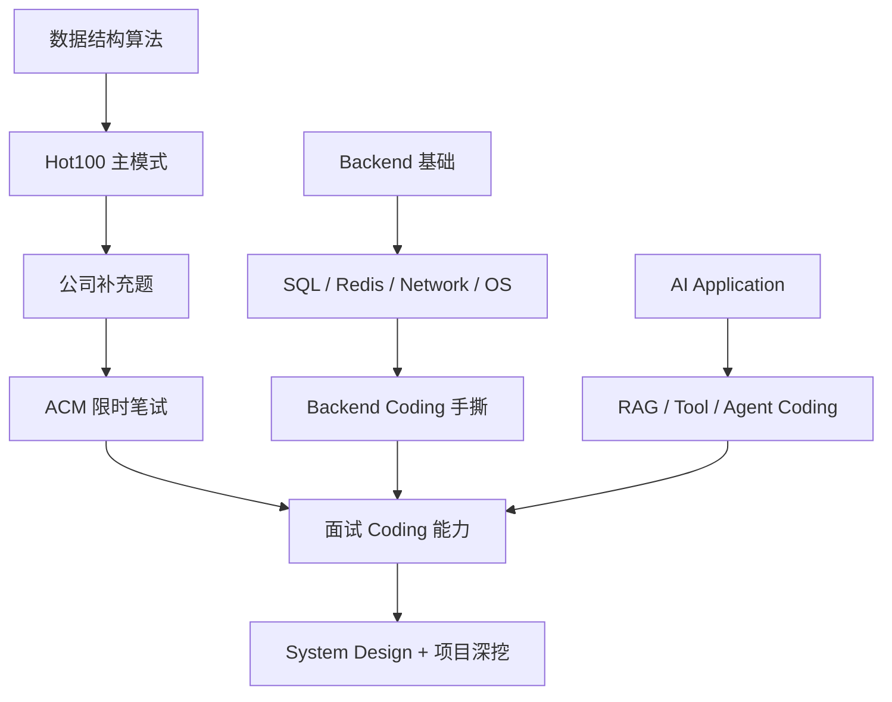

你不是要成为竞赛选手，而是要做到：

- 中等算法题大部分能独立写；
- 能写 SQL；
- 能手撕几个典型后端组件；
- 能在 30–60 分钟做一个小型 AI Backend 功能；
- 能解释复杂度、边界、并发与 trade-off。

---

# 1. 一道题怎样才算“会”

建议每题用四级状态：

- `A`：完全不会；
- `B`：看解析能理解；
- `C`：当天能从空白写；
- `D`：一周后还能从空白写，并能处理一个变化题。

P0 题最终应尽量达到 `D`。

每题固定训练：

```text
识别信号
→ 口述思路
→ 写代码
→ 手测边界
→ 复杂度
→ 面试官改条件
→ 一周后复写
```

最重要：**不要把“AC 过一次”当成掌握。**

---

# 2. 推荐学习顺序

```mermaid
flowchart LR
    A[Array / Hash] --> B[Two Pointers]
    B --> C[Sliding Window]
    C --> D[Prefix Sum]
    D --> E[Linked List]
    E --> F[Stack / Queue]
    F --> G[Tree / BST]
    G --> H[Heap / TopK]
    H --> I[Binary Search]
    I --> J[Graph DFS/BFS]
    J --> K[Topo / Union Find]
    K --> L[Backtracking]
    L --> M[Greedy]
    M --> N[DP]
    N --> O[Interval / Monotonic]
    O --> P[Trie / LRU / Engineering]
```

不要按 LeetCode 首页随机刷。

---

# Part A：算法主干

# 3. Array / Hash

## 3.1 识别信号

看到：

- “是否出现过”；
- “次数”；
- “去重”；
- “配对”；
- “按某种特征分组”；

先想 HashMap / Set。

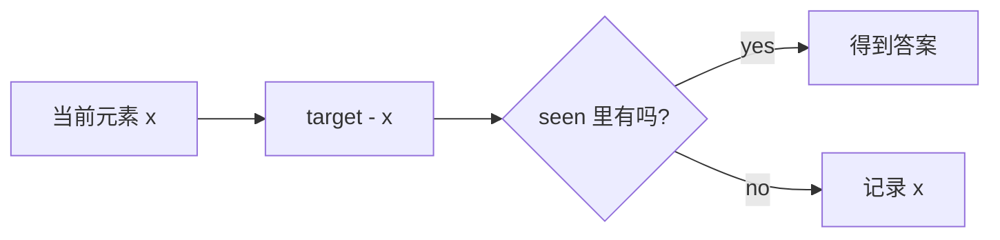

### P0 题

- LC 1 Two Sum
- LC 49 Group Anagrams
- LC 128 Longest Consecutive Sequence
- LC 347 Top K Frequent Elements

### 你必须知道

Python `dict/set` 平均查找通常 O(1)，不是所有极端情况下绝对 O(1)。

### 最小模板

```python
def two_sum(nums, target):
    seen = {}
    for i, x in enumerate(nums):
        need = target - x
        if need in seen:
            return [seen[need], i]
        seen[x] = i
    return []
```

### 面试变化

如果数组有序？

→ 可以进一步想到双指针，不一定需要 Hash。

---

# 4. Two Pointers

## 4.1 关键不是“两根指针”，而是排除不可能答案

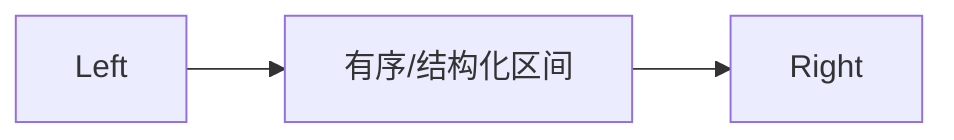

每移动一次指针，都应该有理由：

> “为什么移动它不会漏掉最优答案？”

### P0 题

- LC 283 Move Zeroes
- LC 11 Container With Most Water
- LC 15 3Sum
- LC 42 Trapping Rain Water

### 迁移

链表快慢指针也属于双指针思想：

- 判环；
- 找中点；
- 倒数第 N 个节点。

---

# 5. Sliding Window

这是**算法 → Backend** 最重要的迁移之一。

## 5.1 识别信号

- 连续子串/子数组；
- 最长/最短；
- 窗口满足某条件；
- “最近 N 秒”的请求。

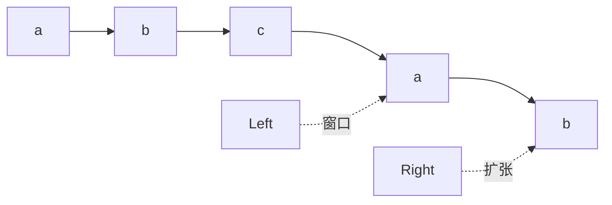

通用模板：

```python
left = 0
for right, x in enumerate(data):
    add(x)
    while window_invalid():
        remove(data[left])
        left += 1
    update_answer(left, right)
```

### P0 题

- LC 3 Longest Substring Without Repeating Characters
- LC 438 Find All Anagrams in a String
- LC 76 Minimum Window Substring
- LC 239 Sliding Window Maximum

### 真正要会

1. 什么时候扩张？
2. 什么时候收缩？
3. `while` 为什么不能换成 `if`？
4. 答案是在收缩前还是收缩后更新？

## 5.2 工程迁移：Rate Limiter

算法题：

> 连续窗口内满足条件。

Backend：

> 最近 60 秒请求不能超过 100 次。

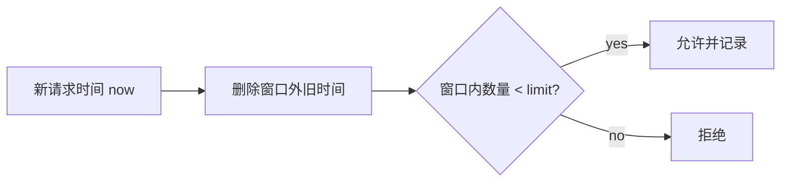

因此面试官让你“手写滑动窗口限流”，本质上不是一个陌生题。

---

# 6. Prefix Sum / Difference

## 6.1 为什么需要 Prefix Sum

如果频繁问：

> `nums[l:r]` 的和？

每次 O(n) 重算太慢。

```text
prefix[i] = nums[0] + ... + nums[i-1]
range(l, r) = prefix[r+1] - prefix[l]
```

### P0/P1

- LC 560 Subarray Sum Equals K
- LC 238 Product of Array Except Self（前后缀思想）
- 二维前缀和
- Difference Array

### 高频陷阱

数组有负数时，很多问题不能用“只向右”的滑动窗口解决。

---

# 7. Linked List

链表题的难点常常不是算法，而是**指针状态容易丢**。

## 7.1 Reverse Linked List 图解

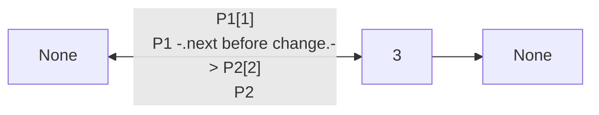

每一步牢记：

```text
next_node = curr.next
curr.next = prev
prev = curr
curr = next_node
```

### P0 题

- LC 206 Reverse Linked List
- LC 21 Merge Two Sorted Lists
- LC 141 Linked List Cycle
- LC 160 Intersection of Two Linked Lists
- LC 19 Remove Nth Node From End
- LC 2 Add Two Numbers

### P1

- LC 25 Reverse Nodes in k-Group
- LC 138 Copy List with Random Pointer

### 必会技巧

Dummy node 能减少“头节点要特殊处理”的分支。

---

# 8. Stack / Queue / Monotonic Structure

## 8.1 Stack

适合：

- 括号匹配；
- 后进先出；
- 递归过程显式化。

P0：

- LC 20 Valid Parentheses
- LC 155 Min Stack

## 8.2 Monotonic Stack

识别信号：

> “对每个元素，找左/右第一个更大/更小。”

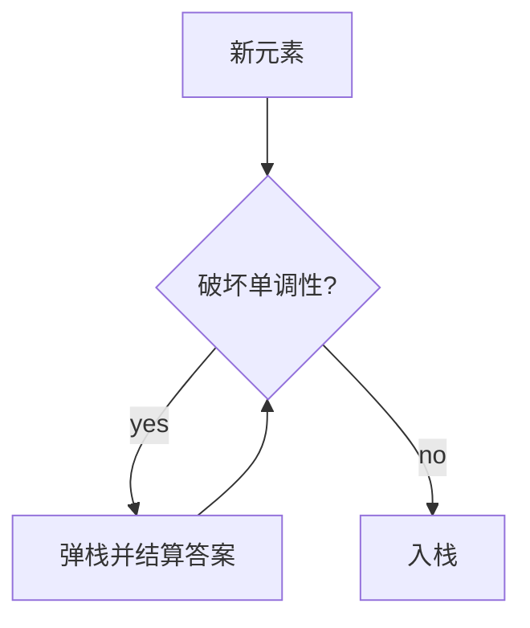

P0：

- LC 739 Daily Temperatures
- LC 84 Largest Rectangle in Histogram

## 8.3 Monotonic Queue

P0/P1：

- LC 239 Sliding Window Maximum

它能维护固定窗口最大值，避免每次 O(k) 扫描。

---

# 9. Binary Tree / BST

树题最重要的是建立**递归函数定义**。

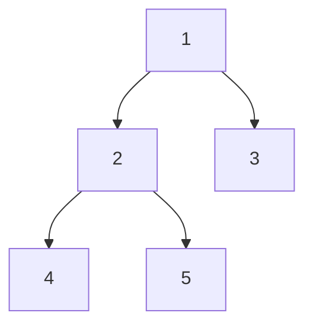

问最大深度时，不要想“我要遍历整棵树”。先定义：

> `depth(node)` = 以 node 为根的子树深度。

然后：

```python
def depth(node):
    if node is None:
        return 0
    return 1 + max(depth(node.left), depth(node.right))
```

### P0

- LC 104 Maximum Depth
- LC 226 Invert Binary Tree
- LC 102 Level Order Traversal
- LC 543 Diameter of Binary Tree
- LC 98 Validate BST
- LC 230 Kth Smallest in BST
- LC 236 Lowest Common Ancestor
- LC 105 Construct Binary Tree from Preorder and Inorder

### BFS 图解

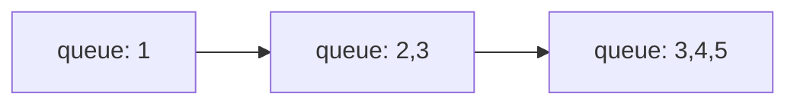

树层序遍历和图 BFS 本质非常接近。

---

# 10. Heap / TopK

堆在 Agent Backend 很实用：

- TopK；
- priority task；
- scheduler；
- streaming median。

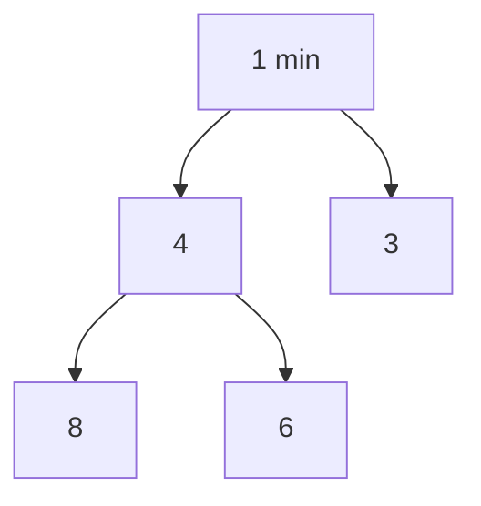

Python `heapq` 默认最小堆。

### P0

- LC 215 Kth Largest Element
- LC 347 Top K Frequent Elements
- LC 23 Merge k Sorted Lists

### P1

- LC 295 Find Median from Data Stream

### 工程迁移

如果只保留最大的 K 个元素：

> 维护大小为 K 的**小顶堆**。

因为堆顶始终是“目前 TopK 中最小的那个”，方便被更大元素替换。

---

# 11. Binary Search

必须会三种：

1. 找精确值；
2. lower_bound / upper_bound；
3. 对答案二分。

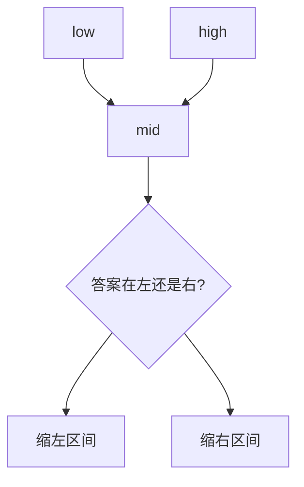

### P0

- LC 704 Binary Search
- LC 33 Search in Rotated Sorted Array
- LC 34 Find First and Last Position
- LC 153 Find Minimum in Rotated Sorted Array

### P1

- LC 875 Koko Eating Bananas

固定一种区间定义，不要 `[l,r]` 和 `[l,r)` 来回换。

---

# 12. Graph：DFS / BFS

### P0

- LC 200 Number of Islands
- LC 994 Rotting Oranges
- LC 133 Clone Graph
- LC 127 Word Ladder（进阶）

二维网格只是图的一种表示。

真正要理解：

```text
node
→ neighbors
→ visited
```

BFS 天然适合无权图最短步数。

---

# 13. Topological Sort

它和 Agent Workflow / DAG 的联系非常强。

假设任务：

```text
解析文档 → 建索引 → 运行评测 → 生成报告
```

有依赖关系。

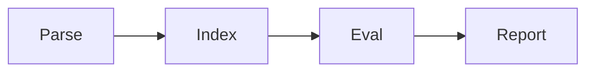

拓扑排序的核心：

1. 统计 indegree；
2. 把 indegree=0 的节点入队；
3. 取出后删除它的出边；
4. 新的 indegree=0 再入队。

### P0

- LC 207 Course Schedule
- LC 210 Course Schedule II

### 工程迁移

- workflow dependency；
- task scheduler；
- build system dependency。

---

# 14. Union Find

适合动态连通问题。

核心：

```text
find(x)
union(a, b)
```

必须理解：

- path compression；
- union by size/rank。

### P1

- LC 547 Number of Provinces
- LC 684 Redundant Connection
- LC 721 Accounts Merge

---

# 15. Backtracking

识别信号：

- 所有组合；
- 所有排列；
- 所有方案；
- 选择 → 递归 → 撤销。

```mermaid
flowchart TD
    ROOT[[]] --> A[[1]]
    ROOT --> B[[2]]
    A --> A2[[1,2]]
    A --> A3[[1,3]]
```

### P0

- LC 78 Subsets
- LC 46 Permutations
- LC 39 Combination Sum
- LC 22 Generate Parentheses
- LC 79 Word Search

核心不是背模板，而是定义：

- path 表示什么；
- choices 是什么；
- 何时结束；
- 哪些选择要剪枝。

---

# 16. Greedy

### P0

- LC 55 Jump Game
- LC 121 Best Time to Buy and Sell Stock
- LC 763 Partition Labels
- LC 56 Merge Intervals

贪心必须能解释：

> 为什么当前局部选择不会破坏未来最优解？

如果完全讲不出理由，只是记住代码，面试很容易被变化题击穿。

---

# 17. Dynamic Programming

DP 最核心的是“状态定义”，不是数组。

```mermaid
flowchart LR
    STATE[定义 dp[i] 是什么] --> TRANS[状态转移]
    TRANS --> INIT[初始化]
    INIT --> ORDER[遍历顺序]
    ORDER --> OPT[空间优化]
```

### P0

- LC 70 Climbing Stairs
- LC 198 House Robber
- LC 322 Coin Change
- LC 300 Longest Increasing Subsequence
- LC 1143 Longest Common Subsequence
- LC 72 Edit Distance
- LC 416 Partition Equal Subset Sum

### 股票状态机

- LC 121
- LC 122
- LC 309

先能写直观二维 DP，再优化空间。

---

# 18. Interval

### P0

- LC 56 Merge Intervals
- LC 57 Insert Interval
- LC 435 Non-overlapping Intervals

最常见策略：

> 先按 start 排序，再维护当前合并区间。

---

# 19. Sorting

至少能手写：

- Quick Sort；
- Merge Sort；
- Heap Sort 原理。

| 算法 | 平均 | 最坏 | 额外空间 | 稳定 |
|---|---:|---:|---:|---|
| Quick Sort | O(n log n) | O(n²) | 递归栈 | 否 |
| Merge Sort | O(n log n) | O(n log n) | O(n) | 是 |
| Heap Sort | O(n log n) | O(n log n) | 近似 O(1) 原地 | 否 |

不能只会 `sorted()`。

---

# 20. Trie

适合：

- prefix search；
- dictionary；
- route matching。

### P1

- LC 208 Implement Trie
- LC 211 Design Add and Search Words

---

# 21. LRU：算法和 Backend 的交叉必会题

目标：

```text
get O(1)
put O(1)
```

经典结构：

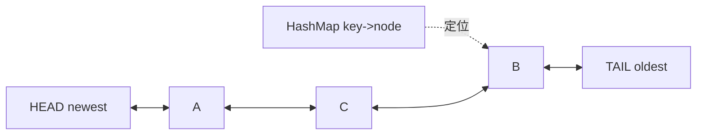

为什么需要 HashMap？

→ O(1) 找节点。

为什么需要 Doubly Linked List？

→ O(1) 从中间删除并移动到头部。

### P0

- LC 146 LRU Cache

不要只会 `OrderedDict` 一行版本。

### 工程迁移

- LLM response cache；
- embedding cache；
- session cache。

---

# 22. Hot100 / 高频题清单

## P0：优先做到一周后能独立写

### Array / Hash

- 1 Two Sum
- 49 Group Anagrams
- 128 Longest Consecutive Sequence
- 347 Top K Frequent Elements

### Two Pointers / Window

- 11 Container With Most Water
- 15 3Sum
- 42 Trapping Rain Water
- 3 Longest Substring Without Repeating Characters
- 438 Find All Anagrams
- 76 Minimum Window Substring

### Linked List

- 206 Reverse Linked List
- 21 Merge Two Sorted Lists
- 141 Linked List Cycle
- 160 Intersection
- 19 Remove Nth From End
- 2 Add Two Numbers
- 146 LRU Cache

### Tree

- 104 Maximum Depth
- 226 Invert Tree
- 102 Level Order
- 543 Diameter
- 98 Validate BST
- 230 Kth Smallest
- 236 LCA
- 105 Build Tree

### Stack / Heap / Binary

- 20 Valid Parentheses
- 155 Min Stack
- 739 Daily Temperatures
- 84 Largest Rectangle
- 215 Kth Largest
- 23 Merge K Lists
- 33 Rotated Search
- 34 First and Last Position

### Graph / Backtracking

- 200 Islands
- 994 Rotting Oranges
- 207 Course Schedule
- 210 Course Schedule II
- 78 Subsets
- 46 Permutations
- 39 Combination Sum
- 22 Generate Parentheses
- 79 Word Search

### DP / Greedy / Interval

- 70 Climbing Stairs
- 198 House Robber
- 322 Coin Change
- 300 LIS
- 1143 LCS
- 72 Edit Distance
- 55 Jump Game
- 56 Merge Intervals

## P1：补充

- 239 Sliding Window Maximum
- 295 Median from Data Stream
- 208 Trie
- 547 Provinces
- 684 Redundant Connection
- 721 Accounts Merge
- 875 Koko Eating Bananas
- 57 Insert Interval
- 435 Non-overlapping Intervals
- Shortest Path / Dijkstra 基础
- Bit Manipulation
- Difference Array

---

# Part B：ACM / 笔试

# 23. 为什么必须练 ACM 输入输出

LeetCode 给你函数：

```python
def solve(nums): ...
```

公司笔试常给：

```text
第一行 n
第二行 n 个整数
```

你需要自己解析。

### 常用模板

```python
import sys

data = sys.stdin.buffer.read().split()
nums = list(map(int, data))
```

多组输入、直到 EOF、矩阵输入都要练。

训练原则：

- 不开 Copilot/Codex；
- 自己处理 I/O；
- 最后手测空输入、1 个元素、极值。

---

# Part C：SQL

# 24. SQL 学习顺序

```text
SELECT / WHERE
→ JOIN
→ GROUP BY / HAVING
→ Subquery / CTE
→ CASE WHEN
→ Window Function
→ TopN per group
→ Index / EXPLAIN
→ Transaction / MVCC
```

## 24.1 Window Function

```sql
SELECT
    user_id,
    amount,
    ROW_NUMBER() OVER (
        PARTITION BY user_id
        ORDER BY amount DESC
    ) AS rn
FROM orders;
```

必须区分：

- ROW_NUMBER；
- RANK；
- DENSE_RANK。

## 24.2 Backend 岗还会追问

- B+ Tree；
- clustered / secondary index；
- covering index；
- back-to-table；
- leftmost prefix；
- ACID；
- isolation level；
- MVCC；
- slow SQL；
- pagination optimization。

---

# Part D：Backend Coding

# 25. Sliding Window Rate Limiter

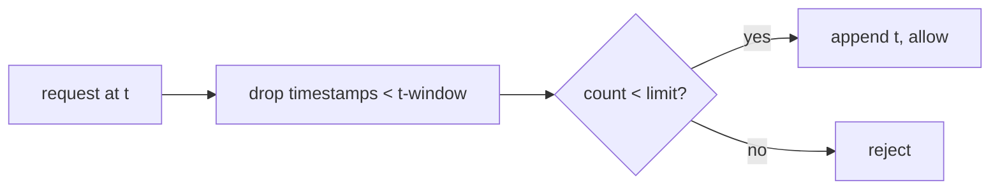

单机版可以用 deque。

然后面试官会继续问：

- 多线程安全吗？
- 多进程怎么办？
- 多机器怎么办？
- 为什么 Redis 可以帮忙？
- fixed window / sliding log / token bucket 区别？

这就是“算法题迁移为工程题”。

---

# 26. Token Bucket

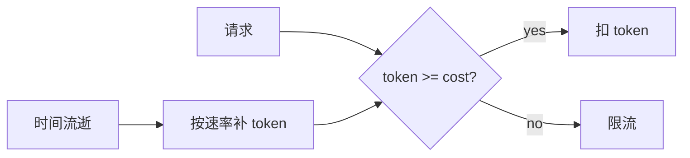

必须解释 burst capacity 和 refill rate。

---

# 27. Retry + Exponential Backoff

```text
attempt 1: wait 1s
attempt 2: wait 2s
attempt 3: wait 4s
```

真实系统还应考虑 jitter。

面试重点：

- 哪些错误可重试？
- 401 为什么一般不盲重试？
- 429 怎么处理？
- 非幂等写操作重复执行怎么办？

---

# 28. Producer / Consumer

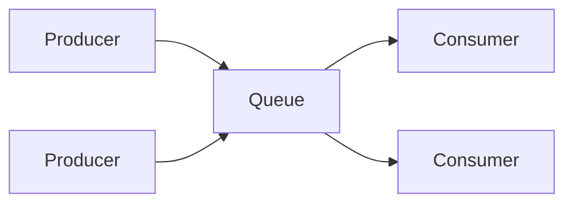

要理解：

- bounded queue；
- blocking；
- backpressure；
- duplicate message；
- retry；
- idempotency。

---

# 29. Backend 手撕清单

至少训练：

1. LRU Cache
2. thread-safe queue
3. producer-consumer
4. sliding-window limiter
5. token bucket
6. retry with backoff
7. timeout wrapper
8. TTL cache
9. simple scheduler
10. simple message queue
11. SSE endpoint
12. semaphore concurrency limit
13. idempotent request handler
14. connection pool 思路
15. distributed lock 思路

---

# Part E：CS 基础

# 30. Redis

必须会：

- String/List/Hash/Set/ZSet；
- expiration；
- eviction；
- persistence；
- cache penetration/breakdown/avalanche；
- hot key / big key；
- distributed lock；
- Redis/MySQL consistency。

# 31. Network

必须会：

- TCP vs UDP；
- three-way handshake；
- four-way close；
- HTTP / HTTPS；
- keep-alive；
- SSE vs WebSocket；
- reverse proxy / gateway；
- 502 vs 504。

# 32. OS / Concurrency

必须会：

- process vs thread；
- context switch；
- mutex / deadlock；
- thread pool；
- I/O multiplexing；
- Python GIL；
- async vs thread vs process；
- producer-consumer。

# 33. MQ / Distributed Basics

至少理解：

- why MQ；
- producer retry；
- consumer retry；
- duplicate；
- idempotency；
- ordering；
- message loss；
- delayed/retry queue；
- eventual consistency。

---

# Part F：AI Coding

# 34. FastAPI LLM Endpoint

30–60 分钟内应该能做：

- Pydantic request/response；
- API key 从环境读取；
- timeout；
- error mapping；
- structured response。

不要把 key 写死在代码。

# 35. SSE

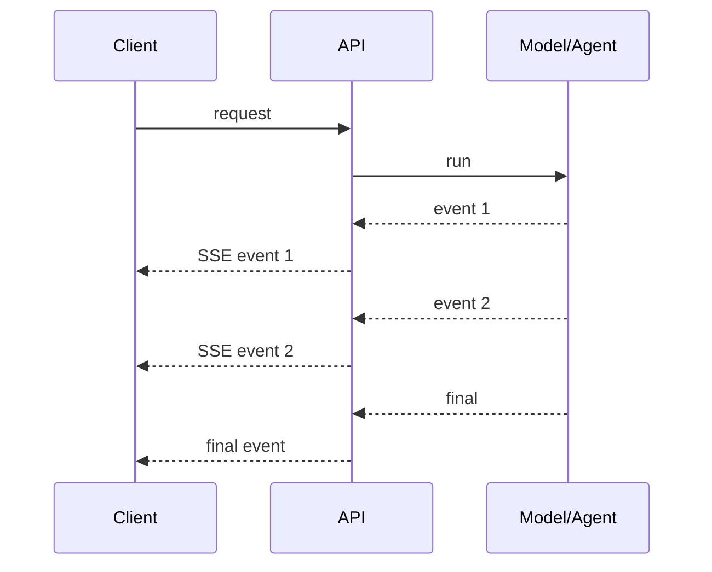

必须解释：

- content type；
- client disconnect；
- cancellation；
- error event；
- SSE vs WebSocket。

# 36. Tool Calling Loop

目标：从空白写一个最小安全版：

```mermaid
flowchart TD
    Q[Question] --> D[Model decision]
    D -->|final| F[Answer]
    D -->|tool| REG[Registry]
    REG --> VAL[Validate args]
    VAL --> EXEC[Execute with timeout]
    EXEC --> OBS[Observation]
    OBS --> D
```

必须包括：

- allowlisted tool；
- schema validation；
- timeout；
- error taxonomy；
- max steps。

这和当前项目 `src/rag_agent/agent/tooling.py` 完全对应，可以把项目当练习答案，但第一次请先自己写。

# 37. Simple RAG

30–60 分钟版本只要求理解流程：

```text
chunk
→ retrieve top-k
→ context
→ prompt
→ answer
→ citation/refusal
```

不要求现场重写 Qdrant。

# 38. Conversation State

至少设计：

- thread_id；
- message history；
- request isolation；
- concurrent requests；
- checkpoint 与 long-term memory 区别。

# 39. Agent Reliability

故意让 Tool 返回：

- timeout；
- invalid JSON；
- 429；
- 500；
- empty result。

你的系统应该分类，不要统一：

```text
Agent failed
```

# 40. Agent Eval

设计固定任务集：

```text
expected tool
expected arguments
should answer / abstain
expected source
```

至少记录：

- task success；
- tool success；
- wrong tool；
- invalid arguments；
- timeout；
- latency。

---

# Part G：System Design

# 41. 设计一个企业 Agent Backend

题目：

> “设计一个支持 RAG、工具调用、长任务、流式输出、失败恢复和高风险操作审批的 Agent 服务。”

你可以按下面层次讲：

```mermaid
flowchart TD
    C[Client] --> GW[API Gateway / Auth / Rate Limit]
    GW --> ORCH[Agent Orchestrator]
    ORCH --> RAG[RAG]
    ORCH --> TOOL[Tool Runtime]
    ORCH --> STATE[(State / Checkpoint)]
    ORCH --> Q[Durable Queue]
    Q --> W[Workers]
    TOOL --> PERM[Permission / HITL]
    ORCH --> OBS[Trace / Metrics / Eval]
    RAG --> V[(Vector DB)]
    RAG --> SQL[(Postgres / Search Store)]
    STATE --> SQL
    W --> SQL
```

面试官关心的不是你能画多少框，而是：

- 为什么需要 queue？
- 哪些状态必须持久化？
- 如何避免重复执行写 Tool？
- 如何取消长任务？
- 用户断开后任务怎么办？
- tool timeout 怎么处理？
- 高风险 action 谁审批？
- 怎么观测一次失败？

---

# Part H：和本项目联动

# 42. 每学一个主题，都去仓库找对应代码

| 面试主题 | 项目对应 |
|---|---|
| Ranking / fusion | `src/rag_agent/retrieval/fusion.py` |
| dict/set/TopK | `retrieval/hybrid.py` |
| state machine | `agent/graph.py` |
| Tool Registry / timeout | `agent/tooling.py` |
| FastAPI / SSE | `api/main.py` |
| task state | `api/jobs.py` |
| SQL / FTS | `retrieval/sqlite_store.py` |
| tests / boundary | `tests/` |

练习原则：

> 先自己写简化版，再看项目实现。

不要一开始照抄项目代码，否则很容易产生“看懂 = 会写”的错觉。

---

# 43. 12 周训练计划

## Week 1

Array/Hash + Two Pointers

目标：Two Sum、3Sum、Longest Consecutive 达到 D。

## Week 2

Sliding Window + Prefix Sum

附加：手写单机 rate limiter。

## Week 3

Linked List + Stack

附加：手写 LRU 第一版。

## Week 4

Tree / BST

附加：递归与 BFS 都能从空白写。

## Week 5

Heap + Binary Search

附加：TopK + priority queue 设计。

## Week 6

Graph / Topological / Union Find

附加：把 workflow DAG 画成拓扑依赖。

## Week 7

Backtracking + Greedy + Interval

目标：组合/排列/区间能识别模式。

## Week 8

DP

目标：Coin Change、LIS、LCS、Edit Distance。

## Week 9

SQL + Redis + Database

至少做：Join、Window、TopN、索引追问。

## Week 10

Backend Coding

Limiter、Retry、Queue、TTL Cache、SSE。

## Week 11

AI Coding

FastAPI + Tool Loop + Simple RAG + State。

## Week 12

System Design + 模拟面试

60–90 分钟闭卷：

- 1 道算法；
- 1 道 SQL；
- 1 个 backend component；
- 1 个 Agent system design。

---

# 44. 每周复习法

同一道题：

```text
Day 0 学会
Day 1 复写
Day 3 复写
Day 7 复写
Day 14 再测
```

如果 Day 7 写不出，状态从 D 降回 C/B。

不要维护“已刷 200 题”这种虚假安全感。

---

# 45. 最低面试标准

## 算法

- Hot100 P0 主模式稳定；
- 大部分中等题能独立完成；
- 会复杂度与边界分析。

## SQL

- Join / Group / Window / TopN 能现场写；
- B+ Tree / index / transaction 能解释。

## Backend

- Redis / DB / HTTP / SSE / concurrency / MQ 能解释；
- LRU / limiter / retry / queue 至少数个能现场写。

## AI Coding

- FastAPI + Tool Calling/RAG + timeout/state 能做最小版本。

## System Design

- 能设计 Agent 服务的 API、state、tool、RAG、queue、storage、security、observability、eval。

## 项目

- 能从业务问题讲到代码、失败、指标、trade-off；
- 不只背 README。

---

# 46. 最后自测

不看文档回答：

1. 为什么滑动窗口可以迁移到 rate limiting？
2. 为什么 LRU 需要 HashMap + Doubly Linked List？
3. TopK 为什么常用大小 K 的小顶堆？
4. 拓扑排序为什么适合任务依赖？
5. BFS 为什么适合无权最短路？
6. Prefix Sum 为什么能把区间和查询降到 O(1)？
7. DP 的状态定义为什么比公式更重要？
8. 一个 retry 为什么必须考虑 idempotency？
9. SSE 和 WebSocket 有什么区别？
10. 一个 Agent Tool Loop 至少需要哪些安全边界？
11. 如果 Tool timeout，系统为什么不能只返回一个模糊的 500？
12. 设计 durable task 时为什么需要 persistent state + worker + retry/lease？

如果只能背答案，回到对应章节并从空白写代码。
