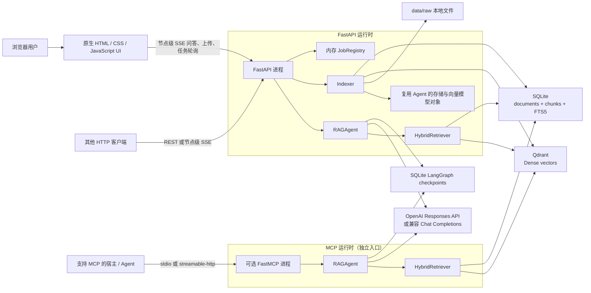
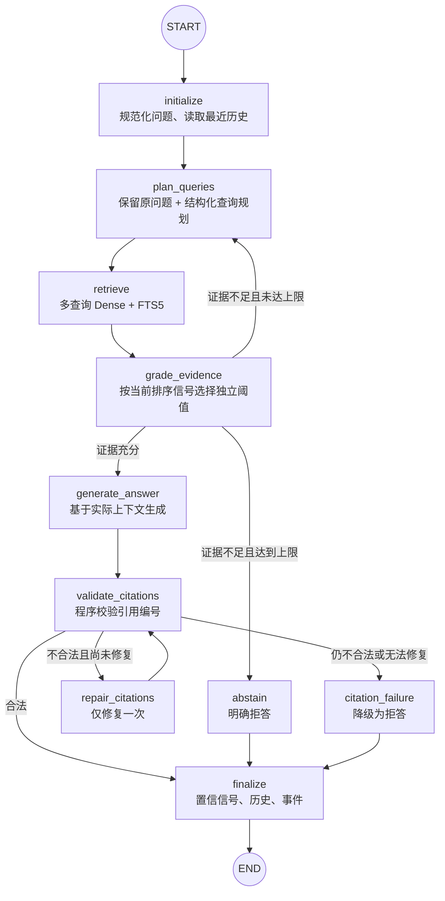
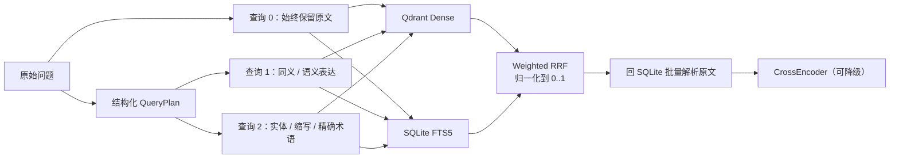
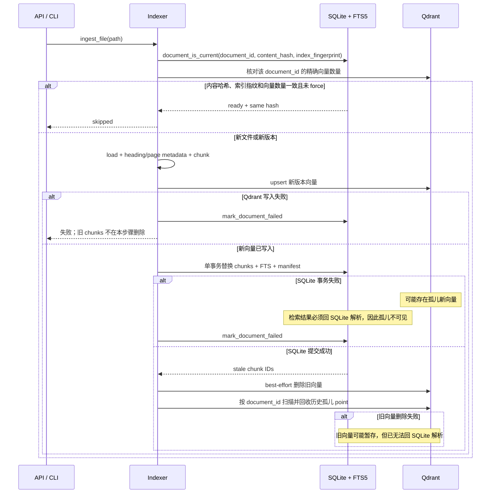

# Adaptive RAG Agent 架构说明

## 1. 文档范围

本文描述当前仓库已经实现的架构，不把计划中的能力写成既成事实。系统定位是一个适合本地演示和招聘作品集的企业知识库 Agent：

- 用 LangGraph 编排有界、自适应的 RAG 工作流。
- 用 Qdrant 做语义检索，用 SQLite FTS5 做关键词检索。
- 用加权 RRF 融合多查询、多检索器结果，并可选用 CrossEncoder 重排。
- 在生成前做证据门控，在生成后做服务端引用编号校验。
- 通过 FastAPI 提供问答、节点级 SSE、文档上传和任务状态接口。
- 提供零构建 Web UI，以及可选的只读 MCP 接口。

它不是多租户 SaaS，也不是声称已经大规模生产落地的系统。当前设计主动避免引入 Redis、Celery、Kafka、Kubernetes 等与演示规模不相称的组件。

## 2. 总体架构

边界说明：

- Web UI 由 FastAPI 直接托管，不需要 Node.js 构建链。
- API 与 MCP 是两个入口。MCP 不转发 HTTP 请求，而是直接创建自己的 `RAGAgent`，并使用相同配置访问本地索引。
- API 生命周期中，`Indexer` 复用 Agent 已创建的 SQLite、Qdrant 和懒加载模型对象，避免每次上传都重复加载 embedding 模型。
- SQLite 是文本、文档清单和关键词检索的权威数据源；Qdrant 保存 dense vector 和轻量 payload。
- 后台导入任务和任务状态保存在进程内存中，服务重启后不会恢复。

## 3. 自适应 LangGraph

### 3.1 状态图

### 3.2 节点职责

| 节点 | 已实现职责 |
|---|---|
| `initialize` | NFKC 规范化用户输入、去控制字符、校验长度，并从 checkpoint 状态保留最近 6 轮历史。 |
| `plan_queries` | 模型可用时生成符合 Pydantic Schema 的查询计划；无论模型输出什么，原始问题都保留在第一位。 |
| `retrieve` | 对查询变体执行 dense 与 FTS5 检索，使用加权 RRF 融合，再用原问题进行可选 rerank。 |
| `grade_evidence` | reranker 可用时检查其固定归一化信号；否则检查 dense cosine 或 sparse token coverage。RRF 只参与排序。 |
| `generate_answer` | 只把上下文预算内的来源交给模型；返回的 sources 与模型看到的来源保持一致。 |
| `validate_citations` | 检查实质性回答是否至少包含一个 `[S数字]`，以及所有编号是否属于本次上下文。 |
| `repair_citations` | 引用不合法时，仅允许模型依据原上下文修复一次。 |
| `abstain` / `citation_failure` | 返回明确拒答，并清空低相关候选的路径与 quote，避免门控旁路。 |
| `finalize` | 汇总状态、相关性信号、最近历史、节点耗时和模型 usage。 |

### 3.3 为什么采用有界重试

系统不实现无限“反思”循环：

- 检索尝试次数由 `MAX_RETRIEVAL_ATTEMPTS` 控制，默认 2 次，配置上限为 4。
- 每次最多使用 `MAX_QUERY_VARIANTS` 个查询，默认 3 个。
- 引用修复硬限制为 1 次。
- OpenAI SDK 传输层另外设置了 60 秒超时和最多 2 次 SDK 重试。

工作流重试与网络重试解决的是不同问题：

- 工作流重试用于改变查询表达，提高召回。
- SDK 重试用于处理瞬时网络或服务错误。

有界预算使最坏调用次数、延迟和成本可解释，也避免 Agent 因错误判断进入无限循环。

### 3.4 查询规划与混合检索

设计要点：

- dense 与 BM25/FTS5 原始分数不可直接相加，因此融合阶段只比较排名。
- 原问题查询权重最高，自动生成的查询权重逐步降低，避免查询改写覆盖错误码和专有名词。
- RRF 根据所有有效 ranking 的总权重归一化到 `[0, 1]`，降低查询变体数量对阈值的影响。
- CrossEncoder 的原始分数单独保留；排序用分数经稳定 sigmoid 映射后的 `[0, 1]` 相关性。
- `confidence` 是当前最佳检索相关性信号，不是“答案正确概率”。

### 3.5 检查点与多轮状态

默认使用 `SqliteSaver` 将 LangGraph 状态保存到 `storage/checkpoints.db`。调用方复用同一个 `thread_id` 时：

1. LangGraph 读取该线程的 checkpoint。
2. `initialize` 从已有状态取最近历史。
3. 查询规划可参考最近两轮对话。
4. `finalize` 仅保留最近 6 轮问答，控制状态大小。

检查点提供持久化状态基础，但当前 HTTP API没有“列出线程”“人工中断后审批恢复”等管理接口。因此准确表述应是：

> 当前实现支持基于 `thread_id` 的持久化多轮状态；LangGraph checkpointer 为故障恢复提供基础设施，但尚未实现面向用户的中断任务恢复控制台。

### 3.6 节点级流式事件

`POST /api/v1/chat/stream` 使用 SSE 输出：

- 每个 LangGraph 节点完成后的 `node` 事件。
- 工作流完成后的一个 `final` 事件。
- 每个事件携带 `trace_id`，节点事件包含该节点耗时和有限调试字段。

当前不是 token-by-token 模型输出流。Web UI 消费该 SSE 端点显示节点进度，并在
`final` 事件到达后渲染完整答案。

## 4. 上下文与引用校验

### 4.1 上下文构造

检索文档被视为不可信数据：

- 文档文本经过 HTML 转义后放入 XML-like `<source>` / `<content>` 容器。
- 检测到的 prompt injection 信号记录在 `security_flags`。
- 风险检测只做标记，不静默删除可能合法的安全文档。
- 上下文按 `MAX_CONTEXT_CHARS` 截断。
- 即使首个 chunk 超过预算，也会在预算足够时保留其一部分，避免证据门控通过后向模型传入空上下文。
- API 只返回真正进入上下文的候选来源，因此 `[S1]` 等编号与模型输入一致。

### 4.2 校验范围

当前引用校验是确定性的格式和映射校验：

- 实质性答案至少引用一个来源。
- `[S数字]` 必须落在本次 sources 范围内。
- 拒答不要求引用。

它尚未验证“每一句话是否被所引文档语义蕴含”。因此不应把当前能力描述为 claim-level entailment、事实核验或零幻觉保证。若需要升级，应新增带人工校准集的 claim-to-evidence evaluator，而不是只增加 Prompt。

## 5. 双存储入库一致性

### 5.1 数据职责

| 存储 | 作用 |
|---|---|
| 本地文件 | 保存上传后的原始 PDF、DOCX、Markdown、TXT 或 HTML。 |
| SQLite `documents` | 文档清单：`document_id`、内容哈希、`index_fingerprint`、状态、chunk 数、错误和更新时间。 |
| SQLite `chunks` | 权威 chunk 原文和 metadata。 |
| SQLite `chunks_fts` | 英文/数字 token 与中文连续文本 bigram 的关键词检索。 |
| Qdrant | chunk dense vector 与轻量 payload，不保存权威原文。 |

`document_id` 来自规范化绝对 source path 的 SHA-256；`content_hash` 来自文件完整字节。
manifest 还保存切片参数、embedding、collection 和 schema 版本形成的 `index_fingerprint`。
上传任务使用不可变请求快照；稳定逻辑路径的替换、内容哈希、解析和入库在同一进程锁内完成。
相同 `thread_id` 的图调用同样使用进程内 single-flight，防止并发 checkpoint 覆盖；
多 worker 部署需换成分布式锁或乐观版本控制。
只有内容、指纹和 Qdrant 文档向量数量都一致时才跳过。

chunk ID 包含完整 chunk 文本、文档 ID、内容哈希、页码、标题层级和 chunk 序号，避免只取文本前缀造成碰撞。

### 5.2 更新顺序

系统没有假装 SQLite 与 Qdrant 之间存在分布式事务，而是采用“权威文本表 + 可容忍孤儿向量”的一致性策略。

该方案保证：

- Qdrant 写失败时，不先删除 SQLite 中旧的可检索 chunk。
- SQLite 的同一文档 chunk、FTS 和 manifest 在一个本地事务中替换。
- Dense 命中必须通过 SQLite `get_chunks` 批量解析，孤儿或过期向量不会进入最终候选。
- 旧向量清理失败只造成暂时存储浪费；下次入库会按 `document_id` 做集合式 reconcile，
  不会把已删除旧文本提供给模型。

该方案不保证：

- 两个存储的物理数据在每个瞬间完全一致。
- 服务启动时全 collection 扫描和回收所有孤儿向量；当前是在该文档下次入库时回收。
- `reset` 操作具备跨存储原子性。

`reset` 会先重置 Qdrant，再重置 SQLite；它是开发维护操作，调用方必须额外保护。

## 6. API、UI 与 MCP 边界

### 6.1 FastAPI

| 接口 | 用途 |
|---|---|
| `GET /health/live` | 进程存活检查，不加载模型。 |
| `GET /health/ready` | 检查 SQLite 和 Qdrant；任一不可用时返回 503/degraded。 |
| `POST /api/v1/chat` | 完整同步问答结果，可选择返回节点 trace。 |
| `POST /api/v1/chat/stream` | 节点级 SSE 与最终结果。 |
| `POST /api/v1/ingest` | 使用独立管理员 Key，仅允许导入 `ALLOWED_INGEST_ROOT` 内的服务端路径。 |
| `POST /api/v1/documents` | 有数量、大小、后缀、文件名和部分 magic bytes 检查的上传。 |
| `GET /api/v1/jobs/{job_id}` | 查询当前进程内导入任务状态。 |
| `GET /api/v1/sources` | 查看文档清单、版本哈希、状态和 chunk 数。 |

普通聊天/读取接口可通过 `API_ACCESS_KEY` 启用共享密钥校验；上传在该 Key 未配置时关闭。
服务器路径导入和 reset 使用独立 `ADMIN_API_KEY`，未配置时同样关闭。两者都只适合本地
演示或受控网络，不等同于用户认证、租户隔离和 RBAC。

### 6.2 Web UI

当前 UI 是 FastAPI 托管的零构建静态页面：

- 检查 `/health/ready`。
- 上传文件并轮询 job。
- 展示已索引来源。
- 通过 fetch 消费 `/api/v1/chat/stream` 的节点级 SSE。
- 展示回答状态、相关性信号、token usage、引用卡片和节点 trace。
- 点击 `[S1]` 可定位到对应证据卡片。
- `thread_id` 保存在浏览器 `localStorage`；API Key 保存在 `sessionStorage`。
  聊天允许本地无 Key 演示，但上传在 Key 未配置时关闭。

UI 不包含账号系统、文档删除、评测看板或 token 流式渲染。

### 6.3 MCP

MCP 是可选依赖和独立启动入口，补充而不替代 HTTP API：

| 类型 | 名称 | 边界 |
|---|---|---|
| Tool | `search_knowledge_base` | 返回排序后的证据，`top_k` 限制在 1–20。 |
| Tool | `ask_knowledge_base` | 运行同一套有界 RAG 工作流，不返回内部 trace。 |
| Resource | `rag://sources` | 只读列出当前文档清单。 |
| Prompt | Grounded research | 提示宿主先检索、再按来源回答。 |

MCP 不暴露上传、任意路径导入或 reset，避免宿主 Agent 通过协议执行破坏性索引操作。

## 7. 降级策略

| 失败点 | 当前行为 | 用户可见结果 |
|---|---|---|
| QueryPlan 模型调用失败 | 保留原始问题继续检索。 | trace 中标记 `original_query_fallback` 和 error。 |
| Qdrant dense 检索失败 | 每个查询独立捕获错误，继续使用 FTS5。 | `backend_errors` 可在 trace 中查看。 |
| FTS5 检索失败 | 若 dense 可用，继续融合 dense ranking。 | 检索质量可能下降。 |
| 两路均无结果 | 返回空候选，按上限重试，最终拒答。 | `abstained=true`。 |
| Reranker 下载或加载失败 | 永久关闭本进程 reranker，按归一化 fusion score 返回。 | 服务继续工作，但精排缺失。 |
| 未配置 LLM | 入库和检索仍可工作；最终生成节点不伪造答案。 | 返回“已检索但未配置模型”并标记拒答。 |
| 回答模型调用失败 | 不返回未经模型生成的拼接答案。 | 返回模型暂不可用并标记拒答。 |
| 引用缺失或越界 | 尝试修复一次；仍失败则拒答。 | 不把引用不合法的答案当作成功。 |
| 旧向量删除失败 | 记录 warning；SQLite 已删除的 ID 无法解析。 | 正确性不受影响，可能暂时浪费 Qdrant 空间。 |
| 任一存储 readiness 失败 | `/health/ready` 返回 503。 | 编排器可判断实例处于 degraded。 |

## 8. 可观测性与评测

每个节点记录：

- 节点名和耗时。
- 查询数量、检索次数和策略。
- 检索后端错误、融合候选数、reranker 状态。
- 上下文长度、是否截断、来源数。
- 引用校验结果。
- 模型 ID、响应 ID、输入/输出 token 和模型调用耗时。

这些事件是操作性 trace，不包含模型的隐藏推理过程。

离线检索评测脚本实现了：

- Recall@5/10。
- MRR。
- nDCG@5/10。
- 每题检索耗时，以及 mean、p50、p95。
- JSON 和 Markdown 报告。

当前样例集规模很小，且 `should_answer` 尚未进入拒答指标计算。因此生成质量、引用语义正确率和拒答 Precision/Recall 仍需单独建设，不能从现有检索报告推导。

## 9. 当前限制

- JobRegistry 仅驻留单进程内存，重启后任务状态丢失，也不适合多 worker。
- SQLite 适合本地和作品集规模，不代表已经验证高并发写入。
- PDF 仅做文本抽取，没有扫描件 OCR、版面理解或图片 RAG。
- DOCX 支持普通段落和表格文本，但不保留复杂样式。
- 没有文档删除 HTTP/MCP 接口。
- 没有多租户、RBAC、审计日志和细粒度文档权限过滤。
- 引用校验验证编号映射，不验证逐句语义支持关系。
- Web UI 使用节点级 SSE，但它不是 provider token 流。
- 当前评测集不足以支撑“大规模”“生产级”“显著提升百分比”等结论。

这些限制是架构边界，而不是需要隐藏的缺点。面试中能够说明取舍、失败模式和下一步，比堆叠更多框架更有说服力。
