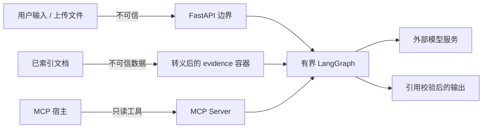

# 安全边界与威胁模型

本项目是单机作品集部署，不是完整的多租户安全平台。本文件说明已经实现的防护、
仍然存在的限制，以及从本地演示走向公开服务前必须补齐的工作。

## 1. 信任边界

默认假设：

- 用户问题、文件名、文件内容和检索片段都可能是恶意的。
- LLM 输出可能格式错误、引用不存在或包含无证据陈述。
- Qdrant、外部模型和网络可能暂时不可用。
- 本机操作者和 `.env` 配置是可信的；公开网络用户不是。

## 2. 已实现控制

### API 与文件

- 业务接口可通过 `API_ACCESS_KEY` 启用恒定时间比较的共享密钥校验。
- 文件上传要求 `API_ACCESS_KEY` 必须已配置，避免任意网页利用 safelisted multipart
  请求向本机服务触发解析与 embedding；Trusted Host allowlist 同时降低 DNS rebinding 风险。
- `/api/v1/ingest` 需要独立 `ADMIN_API_KEY`，并只允许访问
  `ALLOWED_INGEST_ROOT` 内的路径；未配置管理员 Key 时入口关闭。
- 每个递归发现的文件都会在解析 symlink 后再次验证根目录边界。
- 上传只接受 allowlist 后缀，并限制单请求文件数量与单文件大小。
- 上传先写随机临时文件并完成校验，再原子替换“原始文件名哈希 + 清洗名称”的稳定目标；
  因此同名修订会更新一个逻辑文档，而不是留下多个可检索版本。
- 内容按 1 MiB 流式写入，不把整个文件一次性读入内存。
- 该单文件检查发生在 Starlette 完成 multipart 解析之后，不等于请求体前置限流；
  公开部署必须在反向代理/网关设置总请求体上限。`Content-Length` 只能快速拒绝部分请求，
  对 chunked 传输仍需流量层强制限制。
- PDF 和 DOCX 做基础 magic bytes 校验；空文件拒绝。
- 入库任务串行持有进程内锁，避免同一进程并发 reset/写索引。
- 同名上传先形成不可变临时快照，再在同一个入库锁内提交到稳定路径并完成 hash/parse/index，
  防止并发修订在计算哈希和解析之间替换文件。
- 浏览器上传会单独持久化 `display_name`；资料清单不返回绝对路径、解析错误或索引指纹。
- `DELETE /api/v1/sources/{document_id}` 只接受 64 位文档 ID，并与入库共用同一把锁。
  SQLite/FTS 先事务删除以立即阻断检索，再补偿清理 Qdrant 与受管上传副本。
- 普通应用 Key 只能删除 `ALLOWED_INGEST_ROOT/uploads` 下的受管文件；服务器路径导入的
  原文件不能通过网页删除。外部向量清理失败会被明确报告为 deferred，而不会恢复已删除索引。

### RAG 与模型

- 问题做 NFKC 规范化、控制字符清理和长度限制。
- 检索文档经过 HTML 转义后放入 `<evidence>`，不会进入 system/developer 指令。
- 常见中英文 Prompt Injection 特征写入 `security_flags`，便于审计。
- 模型只在查询规划、证据回答和一次引用修复中被调用；循环次数有上限。
- `LLM_STORE_RESPONSES=false` 为默认值，减少企业资料在提供商侧持久化。
- 用户问题、有限对话历史和检索证据仍会发送到 `OPENAI_BASE_URL`；
  `store=false` 不等于本地推理或提供商零留存。
- SQLite checkpoint 会保存完整 Agent state，其中可能包含问题、回答、历史和被选中的证据片段；
  文件目前是本机明文存储，没有 TTL、按线程删除 API 或静态加密。资料删除接口只处理当前
  文档索引和受管上传文件，不等价于清除历史 checkpoint 中已复制的证据。
- 同一进程内，相同 `thread_id` 的问答使用 per-thread single-flight，避免并发 checkpoint
  覆盖和流式响应串线；多 worker 部署仍需要分布式锁或带版本的冲突控制。
- 证据不足、模型不可用或引用修复失败时明确拒答。
- 拒答响应不会返回低相关候选的原文 quote 或路径；证据门控失败不能被来源元数据旁路。
- 答案中的 `[S数字]` 必须映射到模型本轮实际看到的来源。

### 存储与网络

- Qdrant Docker 端口默认只绑定 `127.0.0.1`。
- Docker 应用以非 root 用户运行。
- 依赖按 major version 设上限，Qdrant 容器使用固定版本标签。
- MCP 只提供搜索、问答和来源读取；不暴露上传、reset 或任意文件访问。
- SQLite 启用 WAL、busy timeout 和写锁；文档文本、FTS 与 manifest 同事务替换。

## 3. 已知限制

| 风险 | 当前状态 | 影响 |
|---|---|---|
| 共享 API Key | 只有单一密钥，没有用户身份、RBAC 或轮换端点 | 不适合多租户公网服务 |
| 上传扫描 | 只做大小、后缀和部分 magic 校验 | 不能替代杀毒、沙箱解析或 CDR |
| Prompt Injection | 标签 + 提示隔离，不是形式化安全沙箱 | 恶意文档仍可能影响模型文本 |
| 引用校验 | 验证编号存在，不验证 claim 语义蕴含 | 不能宣称事实完全正确 |
| MCP HTTP | 提供可配置传输，但未实现 OAuth/TLS/租户权限 | 默认只建议本地 stdio |
| JobRegistry | 状态在内存中 | 重启后任务状态丢失，多 worker 不共享 |
| Checkpoint | 支持持久化多轮状态 | 尚无线程管理、审批中断或恢复控制台 |
| 数据保留 | 可删除当前资料索引，但 checkpoint 仍可能复制问题与证据，且无 TTL/线程擦除/静态加密 | 不应存放未获授权的机密资料 |
| Qdrant API key | 支持配置但本地 Compose 默认未启用 | 只能在回环/受控网络使用 |
| 速率限制 | 未实现 | 公开部署可能遭受计算和费用滥用 |
| 文档 ACL | 未实现 | 所有已索引资料属于同一知识域 |
| 机密日志 | 当前 trace 不输出完整内部推理 | 生产仍需集中式脱敏和保留策略 |

## 4. 公开部署前清单

在把端口暴露给非可信网络前，至少完成：

1. 使用 OIDC/OAuth2 或网关身份验证替代共享密钥。
2. 增加租户、知识库和文档级 ACL，并在检索阶段强制过滤。
3. 为问答、上传、入库和模型 token 设置独立速率/配额。
4. 对上传文件做恶意软件扫描、隔离解析和压缩炸弹防护。
5. 用持久化队列替换 `BackgroundTasks + JobRegistry`，保证幂等重试。
6. 给 Qdrant 配置 API key/TLS 或完全放入私有网络。
7. 使用 HTTPS，设置 CORS allowlist、安全响应头和请求体上限。
8. 增加 secret manager、密钥轮换和最小权限文件系统。
9. 将 `thread_id` 绑定到认证主体与租户，增加 checkpoint TTL、删除与加密策略。
10. 对 Prompt Injection、越权检索、恶意 PDF/DOCX 和费用滥用做红队测试。
11. 建立审计日志、敏感字段脱敏、告警和数据删除/保留流程。

## 5. 若未来加入写工具

当前 Agent 不具备发送消息、改工单、删除文件或付费调用等外部副作用。
如果未来加入，必须同时增加：

- 工具 allowlist 和严格的 Pydantic/JSON Schema 参数。
- 读取工具与写入工具分离。
- 危险动作前的 LangGraph `interrupt()` 与人工审批。
- 幂等键、重放保护、超时、补偿和审计记录。
- MCP/OAuth token audience 校验，禁止 token passthrough。

不要仅靠 Prompt 中的“请先确认”充当授权边界。

## 6. 报告问题

不要在公开 Issue 中粘贴 API Key、私有文档、完整 Prompt 或生产日志。
提交安全问题时提供最小复现、受影响版本、预期/实际行为和已脱敏的 trace ID。
